# AWS Network Shell Command Hierarchy

Generated: 2025-12-02T20:43:55.307800

## Statistics

- Total nodes: 103
- Total edges: 108
- Contexts: 9
- Command paths: 97

## Command Graph

```mermaid
graph TD
    classDef root fill:#2d5a27,stroke:#1a3518,color:#fff
    classDef context fill:#1a4a6e,stroke:#0d2840,color:#fff
    classDef show fill:#4a4a8a,stroke:#2d2d5a,color:#fff
    classDef set fill:#6b4c9a,stroke:#3d2a5a,color:#fff
    classDef action fill:#8b4513,stroke:#5a2d0a,color:#fff
    classDef unimpl fill:#666,stroke:#333,color:#fff,stroke-dasharray: 5 5

    root[["aws-net"]]
    class root root
    root --> root_show_version
    root_show_version["show version"]
    class root_show_version show
    root --> root_show_global_networks
    root_show_global_networks["show global-networks"]
    class root_show_global_networks show
    root --> root_show_vpcs
    root_show_vpcs["show vpcs"]
    class root_show_vpcs show
    root --> root_show_transit_gateways
    root_show_transit_gateways["show transit_gateways"]
    class root_show_transit_gateways show
    root --> root_show_firewalls
    root_show_firewalls["show firewalls"]
    class root_show_firewalls show
    root --> root_show_dx_connections
    root_show_dx_connections["show dx-connections"]
    class root_show_dx_connections show
    root --> root_show_enis
    root_show_enis["show enis"]
    class root_show_enis show
    root --> root_show_bgp_neighbors
    root_show_bgp_neighbors["show bgp-neighbors"]
    class root_show_bgp_neighbors show
    root --> root_show_ec2_instances
    root_show_ec2_instances["show ec2-instances"]
    class root_show_ec2_instances show
    root --> root_show_elbs
    root_show_elbs["show elbs"]
    class root_show_elbs show
    root --> root_show_vpns
    root_show_vpns["show vpns"]
    class root_show_vpns show
    root --> root_show_security_groups
    root_show_security_groups["show security-groups"]
    class root_show_security_groups show
    root --> root_show_unused_sgs
    root_show_unused_sgs["show unused-sgs"]
    class root_show_unused_sgs show
    root --> root_show_resolver_endpoints
    root_show_resolver_endpoints["show resolver-endpoints"]
    class root_show_resolver_endpoints show
    root --> root_show_resolver_rules
    root_show_resolver_rules["show resolver-rules"]
    class root_show_resolver_rules show
    root --> root_show_query_logs
    root_show_query_logs["show query-logs"]
    class root_show_query_logs show
    root --> root_show_peering_connections
    root_show_peering_connections["show peering-connections"]
    class root_show_peering_connections show
    root --> root_show_prefix_lists
    root_show_prefix_lists["show prefix-lists"]
    class root_show_prefix_lists show
    root --> root_show_network_alarms
    root_show_network_alarms["show network-alarms"]
    class root_show_network_alarms show
    root --> root_show_alarms_critical
    root_show_alarms_critical["show alarms-critical"]
    class root_show_alarms_critical show
    root --> root_show_client_vpn_endpoints
    root_show_client_vpn_endpoints["show client-vpn-endpoints"]
    class root_show_client_vpn_endpoints show
    root --> root_show_global_accelerators
    root_show_global_accelerators["show global-accelerators"]
    class root_show_global_accelerators show
    root --> root_show_ga_endpoint_health
    root_show_ga_endpoint_health["show ga-endpoint-health"]
    class root_show_ga_endpoint_health show
    root --> root_show_endpoint_services
    root_show_endpoint_services["show endpoint-services"]
    class root_show_endpoint_services show
    root --> root_show_vpc_endpoints
    root_show_vpc_endpoints["show vpc-endpoints"]
    class root_show_vpc_endpoints show
    root --> root_show_config
    root_show_config["show config"]
    class root_show_config show
    root --> root_show_running_config
    root_show_running_config["show running-config"]
    class root_show_running_config show
    root --> root_show_cache
    root_show_cache["show cache"]
    class root_show_cache show
    root --> root_show_routing_cache
    root_show_routing_cache["show routing-cache"]
    class root_show_routing_cache show
    root --> root_show_graph
    root_show_graph["show graph"]
    class root_show_graph show
    root --> root_set_global_network
    root_set_global_network{"set global-network → global-network"}
    class root_set_global_network context
    root_set_global_network --> global_network_show_detail
    global_network_show_detail["show detail"]
    class global_network_show_detail show
    root_set_global_network --> global_network_show_core_networks
    global_network_show_core_networks["show core-networks"]
    class global_network_show_core_networks show
    root_set_global_network --> global_network_set_core_network
    global_network_set_core_network{"set core-network → core-network"}
    class global_network_set_core_network context
    global_network_set_core_network --> core_network_show_detail
    core_network_show_detail["show detail"]
    class core_network_show_detail show
    global_network_set_core_network --> core_network_show_segments
    core_network_show_segments["show segments"]
    class core_network_show_segments show
    global_network_set_core_network --> core_network_show_policy
    core_network_show_policy["show policy"]
    class core_network_show_policy show
    global_network_set_core_network --> core_network_show_routes
    core_network_show_routes["show routes"]
    class core_network_show_routes show
    global_network_set_core_network --> core_network_show_route_tables
    core_network_show_route_tables["show route-tables"]
    class core_network_show_route_tables show
    global_network_set_core_network --> core_network_show_blackhole_routes
    core_network_show_blackhole_routes["show blackhole-routes"]
    class core_network_show_blackhole_routes show
    global_network_set_core_network --> core_network_show_policy_change_events
    core_network_show_policy_change_events["show policy-change-events"]
    class core_network_show_policy_change_events show
    global_network_set_core_network --> core_network_show_connect_attachments
    core_network_show_connect_attachments["show connect-attachments"]
    class core_network_show_connect_attachments show
    global_network_set_core_network --> core_network_show_connect_peers
    core_network_show_connect_peers["show connect-peers"]
    class core_network_show_connect_peers show
    global_network_set_core_network --> core_network_show_rib
    core_network_show_rib["show rib"]
    class core_network_show_rib show
    global_network_set_core_network --> core_network_set_route_table
    core_network_set_route_table{"set route-table → route-table"}
    class core_network_set_route_table context
    core_network_set_route_table --> route_table_show_routes
    route_table_show_routes["show routes"]
    class route_table_show_routes show
    core_network_set_route_table --> route_table_do_find_prefix
    route_table_do_find_prefix(("find_prefix"))
    class route_table_do_find_prefix action
    core_network_set_route_table --> route_table_do_find_null_routes
    route_table_do_find_null_routes(("find_null_routes"))
    class route_table_do_find_null_routes action
    global_network_set_core_network --> core_network_do_find_prefix
    core_network_do_find_prefix(("find_prefix"))
    class core_network_do_find_prefix action
    global_network_set_core_network --> core_network_do_find_null_routes
    core_network_do_find_null_routes(("find_null_routes"))
    class core_network_do_find_null_routes action
    root --> root_set_vpc
    root_set_vpc{"set vpc → vpc"}
    class root_set_vpc context
    root_set_vpc --> vpc_show_detail
    vpc_show_detail["show detail"]
    class vpc_show_detail show
    root_set_vpc --> vpc_show_route_tables
    vpc_show_route_tables["show route-tables"]
    class vpc_show_route_tables show
    root_set_vpc --> vpc_show_subnets
    vpc_show_subnets["show subnets"]
    class vpc_show_subnets show
    root_set_vpc --> vpc_show_security_groups
    vpc_show_security_groups["show security-groups"]
    class vpc_show_security_groups show
    root_set_vpc --> vpc_show_nacls
    vpc_show_nacls["show nacls"]
    class vpc_show_nacls show
    root_set_vpc --> vpc_show_internet_gateways
    vpc_show_internet_gateways["show internet-gateways"]
    class vpc_show_internet_gateways show
    root_set_vpc --> vpc_show_nat_gateways
    vpc_show_nat_gateways["show nat-gateways"]
    class vpc_show_nat_gateways show
    root_set_vpc --> vpc_show_endpoints
    vpc_show_endpoints["show endpoints"]
    class vpc_show_endpoints show
    root_set_vpc --> vpc_set_route_table
    vpc_set_route_table{"set route-table → route-table"}
    class vpc_set_route_table context
    vpc_set_route_table --> route_table_show_routes
    vpc_set_route_table --> route_table_do_find_prefix
    vpc_set_route_table --> route_table_do_find_null_routes
    root_set_vpc --> vpc_do_find_prefix
    vpc_do_find_prefix(("find_prefix"))
    class vpc_do_find_prefix action
    root_set_vpc --> vpc_do_find_null_routes
    vpc_do_find_null_routes(("find_null_routes"))
    class vpc_do_find_null_routes action
    root --> root_set_transit_gateway
    root_set_transit_gateway{"set transit-gateway → transit-gateway"}
    class root_set_transit_gateway context
    root_set_transit_gateway --> transit_gateway_show_detail
    transit_gateway_show_detail["show detail"]
    class transit_gateway_show_detail show
    root_set_transit_gateway --> transit_gateway_show_route_tables
    transit_gateway_show_route_tables["show route-tables"]
    class transit_gateway_show_route_tables show
    root_set_transit_gateway --> transit_gateway_show_attachments
    transit_gateway_show_attachments["show attachments"]
    class transit_gateway_show_attachments show
    root_set_transit_gateway --> transit_gateway_set_route_table
    transit_gateway_set_route_table{"set route-table → route-table"}
    class transit_gateway_set_route_table context
    transit_gateway_set_route_table --> route_table_show_routes
    transit_gateway_set_route_table --> route_table_do_find_prefix
    transit_gateway_set_route_table --> route_table_do_find_null_routes
    root_set_transit_gateway --> transit_gateway_do_find_prefix
    transit_gateway_do_find_prefix(("find_prefix"))
    class transit_gateway_do_find_prefix action
    root_set_transit_gateway --> transit_gateway_do_find_null_routes
    transit_gateway_do_find_null_routes(("find_null_routes"))
    class transit_gateway_do_find_null_routes action
    root --> root_set_firewall
    root_set_firewall{"set firewall → firewall"}
    class root_set_firewall context
    root_set_firewall --> firewall_show_detail
    firewall_show_detail["show detail"]
    class firewall_show_detail show
    root_set_firewall --> firewall_show_rule_groups
    firewall_show_rule_groups["show rule-groups"]
    class firewall_show_rule_groups show
    root_set_firewall --> firewall_show_policy
    firewall_show_policy["show policy"]
    class firewall_show_policy show
    root --> root_set_ec2_instance
    root_set_ec2_instance{"set ec2-instance → ec2-instance"}
    class root_set_ec2_instance context
    root_set_ec2_instance --> ec2_instance_show_detail
    ec2_instance_show_detail["show detail"]
    class ec2_instance_show_detail show
    root_set_ec2_instance --> ec2_instance_show_security_groups
    ec2_instance_show_security_groups["show security-groups"]
    class ec2_instance_show_security_groups show
    root_set_ec2_instance --> ec2_instance_show_enis
    ec2_instance_show_enis["show enis"]
    class ec2_instance_show_enis show
    root_set_ec2_instance --> ec2_instance_show_routes
    ec2_instance_show_routes["show routes"]
    class ec2_instance_show_routes show
    root --> root_set_elb
    root_set_elb{"set elb → elb"}
    class root_set_elb context
    root_set_elb --> elb_show_detail
    elb_show_detail["show detail"]
    class elb_show_detail show
    root_set_elb --> elb_show_listeners
    elb_show_listeners["show listeners"]
    class elb_show_listeners show
    root_set_elb --> elb_show_targets
    elb_show_targets["show targets"]
    class elb_show_targets show
    root_set_elb --> elb_show_health
    elb_show_health["show health"]
    class elb_show_health show
    root --> root_set_vpn
    root_set_vpn{"set vpn → vpn"}
    class root_set_vpn context
    root_set_vpn --> vpn_show_detail
    vpn_show_detail["show detail"]
    class vpn_show_detail show
    root_set_vpn --> vpn_show_tunnels
    vpn_show_tunnels["show tunnels"]
    class vpn_show_tunnels show
    root --> root_set_profile
    root_set_profile(["set profile"])
    class root_set_profile set
    root --> root_set_regions
    root_set_regions(["set regions"])
    class root_set_regions set
    root --> root_set_no_cache
    root_set_no_cache(["set no-cache"])
    class root_set_no_cache set
    root --> root_set_output_format
    root_set_output_format(["set output-format"])
    class root_set_output_format set
    root --> root_set_output_file
    root_set_output_file(["set output-file"])
    class root_set_output_file set
    root --> root_set_watch
    root_set_watch(["set watch"])
    class root_set_watch set
    root --> root_do_write
    root_do_write(("write"))
    class root_do_write action
    root --> root_do_trace
    root_do_trace(("trace"))
    class root_do_trace action
    root --> root_do_find_ip
    root_do_find_ip(("find_ip"))
    class root_do_find_ip action
    root --> root_do_find_prefix
    root_do_find_prefix(("find_prefix"))
    class root_do_find_prefix action
    root --> root_do_find_null_routes
    root_do_find_null_routes(("find_null_routes"))
    class root_do_find_null_routes action
    root --> root_do_populate_cache
    root_do_populate_cache(("populate_cache"))
    class root_do_populate_cache action
    root --> root_do_clear_cache
    root_do_clear_cache(("clear_cache"))
    class root_do_clear_cache action
    root --> root_do_create_routing_cache
    root_do_create_routing_cache(("create_routing_cache"))
    class root_do_create_routing_cache action
    root --> root_do_validate_graph
    root_do_validate_graph(("validate_graph"))
    class root_do_validate_graph action
    root --> root_do_export_graph
    root_do_export_graph(("export_graph"))
    class root_do_export_graph action
```

## Legend

| Shape | Meaning |
|-------|---------|
| `[[name]]` | Root shell |
| `{name}` | Context-entering command |
| `[name]` | Show command |
| `([name])` | Set/config command |
| `((name))` | Action command |
| Dashed border | Not implemented |

## Contexts

### root

**Show:** version, global-networks, vpcs, transit_gateways, firewalls, dx-connections, enis, bgp-neighbors, ec2-instances, elbs, vpns, security-groups, unused-sgs, resolver-endpoints, resolver-rules, query-logs, peering-connections, prefix-lists, network-alarms, alarms-critical, client-vpn-endpoints, global-accelerators, ga-endpoint-health, endpoint-services, vpc-endpoints, config, running-config, cache, routing-cache, graph
**Set:** global-network, vpc, transit-gateway, firewall, ec2-instance, elb, vpn, profile, regions, no-cache, output-format, output-file, watch
**Actions:** write, trace, find_ip, find_prefix, find_null_routes, populate_cache, clear_cache, create_routing_cache, validate_graph, export_graph

### global-network

**Show:** detail, core-networks
**Set:** core-network

### core-network

**Show:** detail, segments, policy, routes, route-tables, blackhole-routes, policy-change-events, connect-attachments, connect-peers, rib
**Set:** route-table
**Actions:** find_prefix, find_null_routes

### route-table

**Show:** routes
**Actions:** find_prefix, find_null_routes

### vpc

**Show:** detail, route-tables, subnets, security-groups, nacls, internet-gateways, nat-gateways, endpoints
**Set:** route-table
**Actions:** find_prefix, find_null_routes

### transit-gateway

**Show:** detail, route-tables, attachments
**Set:** route-table
**Actions:** find_prefix, find_null_routes

### firewall

**Show:** detail, rule-groups, policy

### ec2-instance

**Show:** detail, security-groups, enis, routes

### elb

**Show:** detail, listeners, targets, health

### vpn

**Show:** detail, tunnels
