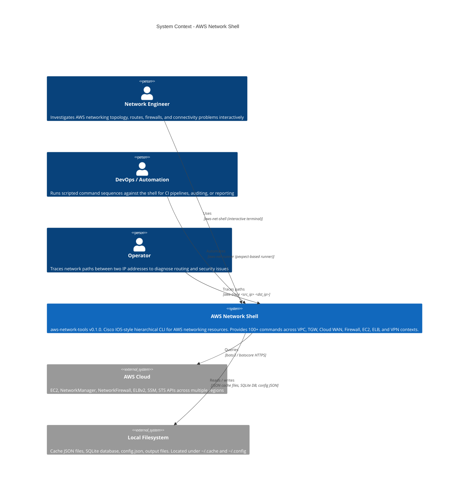
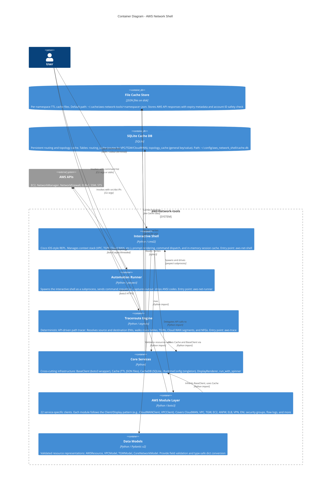
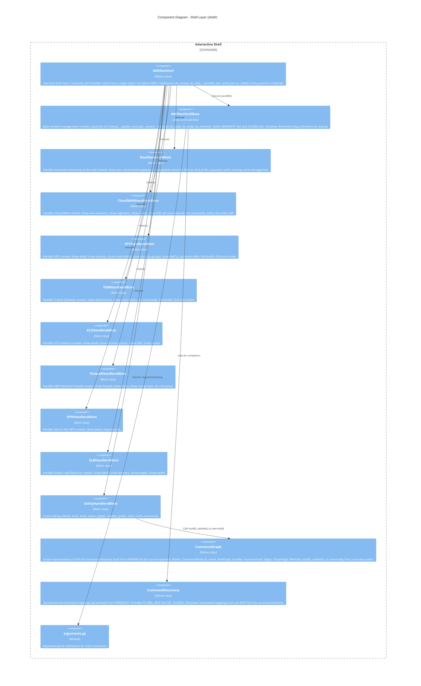
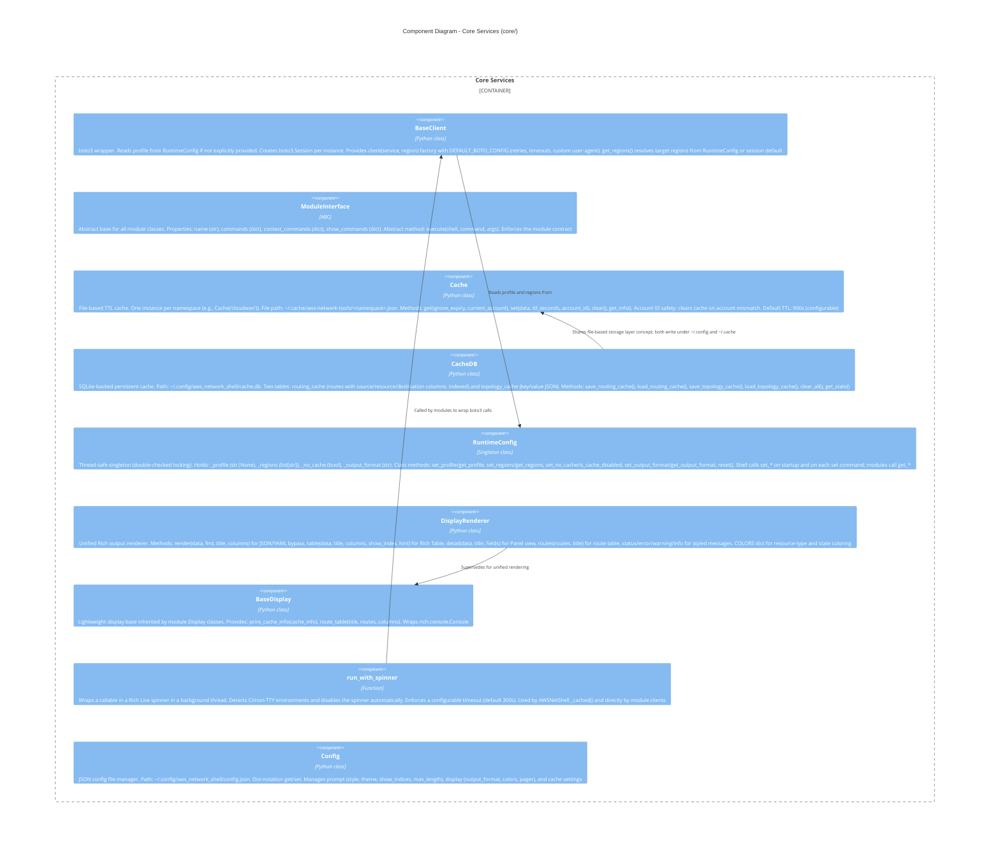
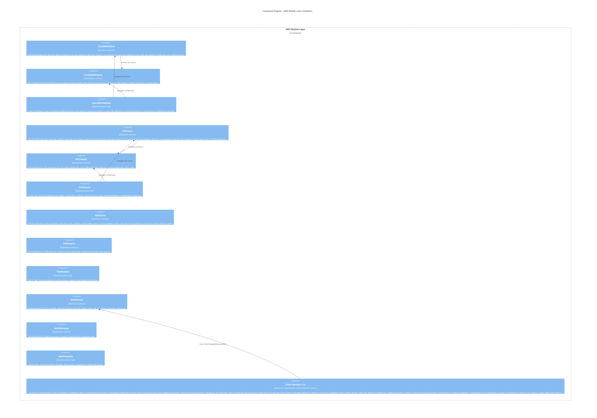
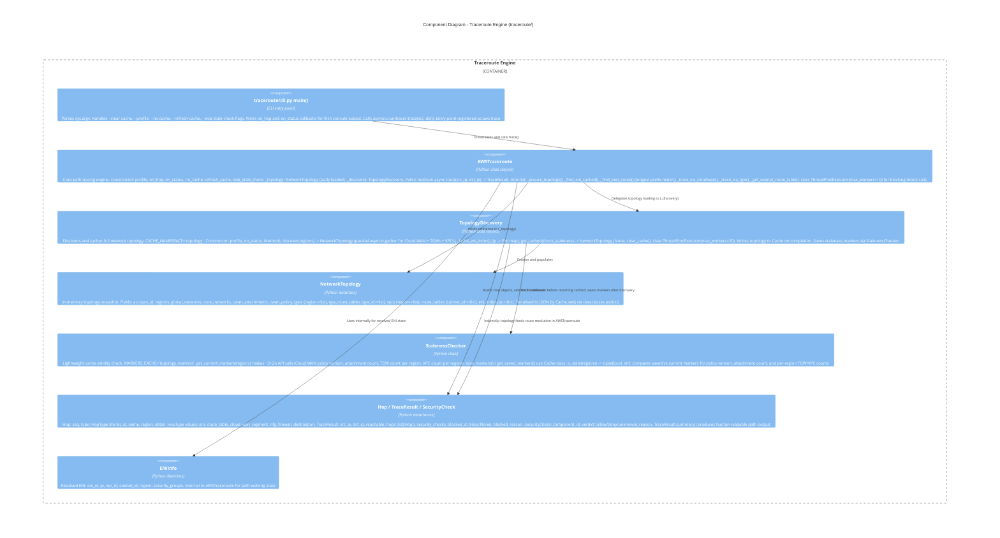
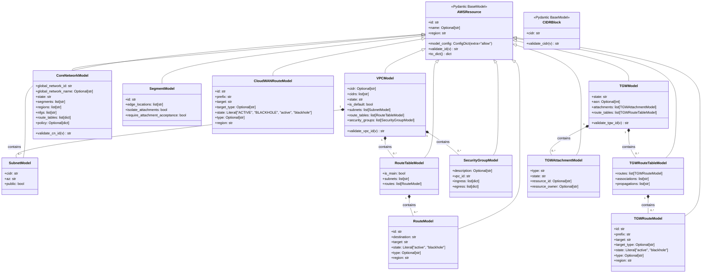

# C4 Architecture: AWS Network Shell

A multi-level architecture document following the C4 model (Context, Containers, Components, Code).

---

## Table of Contents

1. [Level 1: System Context](#level-1-system-context)
2. [Level 2: Container Diagram](#level-2-container-diagram)
3. [Level 3: Component Diagrams](#level-3-component-diagrams)
   - [Shell Components](#31-shell-components)
   - [Core Components](#32-core-components)
   - [Module Components](#33-module-components)
   - [Traceroute Components](#34-traceroute-components)
4. [Level 4: Code-Level Class Diagrams](#level-4-code-level-class-diagrams)
   - [BaseClient Inheritance](#41-baseclient-inheritance-hierarchy)
   - [Shell Composition](#42-shell-composition-via-mixins)
   - [ModuleInterface Hierarchy](#43-moduleinterface-hierarchy)
   - [Pydantic Model Hierarchy](#44-pydantic-model-hierarchy)
5. [Interface Descriptions](#interface-descriptions)

---

## Level 1: System Context

The System Context diagram places AWS Network Shell within its environment, showing who uses it and what external systems it depends on.

**Three distinct user roles interact with the system.** Network Engineers use the interactive shell for live investigation. Automation systems use the runner for scripted workflows. Both invoke the same underlying capabilities. The traceroute engine is available to all three entry points.

The system depends on two external systems: the AWS Cloud (multiple service APIs) and the local filesystem (cache persistence, configuration, output files).



---

## Level 2: Container Diagram

The Container diagram zooms into the AWS Network Shell system, showing the deployable units and how they communicate. All containers run as a single installed Python package (`aws-network-tools`).

The three entry-point containers are independent executables defined in `pyproject.toml`. They share the Core Services and Module Layer through direct Python imports. Cache state is shared on the local filesystem, allowing a topology populated by one entry point to be read by another.



---

## Level 3: Component Diagrams

### 3.1 Shell Components

The Shell layer is built around `cmd2.Cmd`. The base class handles all context state and prompt rendering. Nine handler mixin classes each own a specific domain. `AWSNetShell` composes them all through Python's MRO and adds the `do_show` / `do_set` dispatch loop. `CommandGraph` and `CommandDiscovery` provide introspection, validation, and Mermaid export capabilities.



### 3.2 Core Components

Core Services provide infrastructure used by both the Shell layer and the Module layer. `RuntimeConfig` is a thread-safe singleton that propagates shell state (profile, regions, output format) to modules without requiring explicit parameter passing. `BaseClient` reads from `RuntimeConfig` to create correctly configured boto3 sessions.



### 3.3 Module Components

Each of the 22 modules follows the same structural pattern: a `Client` class (inherits `BaseClient`) handles all API calls; a `Display` class (inherits `BaseDisplay`) handles all Rich rendering; a `Module` class (implements `ModuleInterface`) provides the shell integration contract.



### 3.4 Traceroute Components

The Traceroute Engine operates asynchronously. `TopologyDiscovery` runs three parallel coroutines (Cloud WAN, TGWs, VPCs) across all AWS regions. `AWSTraceroute.trace()` is the single public method: it ensures topology is loaded, resolves ENIs, then walks the path hop by hop. `StalenessChecker` performs a lightweight pre-flight comparison (a few API calls) rather than a full rediscovery to decide whether the cached topology is still valid.



---

## Level 4: Code-Level Class Diagrams

### 4.1 BaseClient Inheritance Hierarchy

All 22 module clients inherit from `BaseClient`. They gain a configured `boto3.Session`, the `client(service, region)` factory, and `get_regions()` which reads from `RuntimeConfig`.

```mermaid
classDiagram
    class BaseClient {
        +profile: Optional[str]
        +session: boto3.Session
        +max_workers: int
        +__init__(profile, session, max_workers)
        +client(service, region_name) boto3.client
        +get_regions() list[str]
    }

    class CloudWANClient {
        +get_global_networks() list
        +get_core_networks(global_network_id) list
        +get_core_network_detail(core_network_id) dict
        +get_core_network_policy(core_network_id) dict
        +list_attachments(core_network_id) list
        +get_network_routes(core_network_id, route_table_id, filters) list
    }

    class VPCClient {
        +get_vpcs(regions) list
        +get_vpc_detail(vpc_id, region) dict
        +get_route_tables(vpc_id, region) list
        +get_subnets(vpc_id, region) list
        +get_security_groups(vpc_id, region) list
        +get_nacls(vpc_id, region) list
    }

    class TGWClient {
        +get_transit_gateways(regions) list
        +get_tgw_route_tables(tgw_id, region) list
        +search_routes(route_table_id, region, filters) list
        +get_attachments(tgw_id, region) list
    }

    class ANFWClient {
        +get_firewalls(regions) list
        +get_firewall_detail(firewall_name, region) dict
        +get_firewall_policy(policy_arn) dict
        +list_rule_groups(policy_arn) list
        +get_rule_group(rule_group_arn) dict
    }

    class ELBClient {
        +get_load_balancers(regions) list
        +get_elb_detail(elb_arn, region) dict
        +get_listeners(elb_arn, region) list
        +get_target_groups(elb_arn, region) list
        +get_target_health(target_group_arn, region) list
    }

    class EC2Client {
        +get_instances(regions, filters) list
        +get_instance_detail(instance_id, region) dict
        +get_instance_enis(instance_id, region) list
    }

    class VPNClient {
        +get_vpn_connections(regions) list
        +get_vpn_detail(vpn_id, region) dict
        +get_tunnel_status(vpn_id, region) list
    }

    BaseClient <|-- CloudWANClient
    BaseClient <|-- VPCClient
    BaseClient <|-- TGWClient
    BaseClient <|-- ANFWClient
    BaseClient <|-- ELBClient
    BaseClient <|-- EC2Client
    BaseClient <|-- VPNClient
    BaseClient <|-- "ENIClient\nDirectConnectClient\nSecurityClient\nFlowLogsClient\nPeeringClient\nPrefixListsClient\nNetworkAlarmsClient\nClientVPNClient\nGlobalAcceleratorClient\nRoute53ResolverClient\nPrivateLinkClient\nReachabilityClient\nIPFinderClient\nOrgClient"
```

### 4.2 Shell Composition via Mixins

`AWSNetShell` is assembled through Python's cooperative multiple inheritance (MRO). The order of base classes in the class definition controls which mixin's method wins when names collide. `AWSNetShellBase` always resolves last and provides the `cmd2.Cmd` foundation.

```mermaid
classDiagram
    direction TB

    class `cmd2.Cmd` {
        +cmdloop()
        +onecmd(line)
        +default(stmt)
        +precmd(line)
    }

    class AWSNetShellBase {
        +intro: str
        +profile: Optional[str]
        +regions: list[str]
        +no_cache: bool
        +output_format: str
        +watch_interval: int
        +context_stack: list[Context]
        +_cache: dict
        +config: Config
        +theme: dict
        +ctx: Optional[Context]
        +ctx_type: Optional[str]
        +ctx_id: str
        +hierarchy: dict
        +__init__()
        +_update_prompt()
        +_enter(ctx_type, res_id, name, data, selection_index)
        +_resolve(items, val) Optional[dict]
        +_sync_runtime_config()
        +do_exit(args)
        +do_end(args)
        +do_refresh(args)
        +do_clear(args)
        +do_clear_cache(args)
        +precmd(line) Statement
        +default(stmt)
    }

    class RootHandlersMixin {
        +_show_vpcs(arg)
        +_show_transit_gateways(arg)
        +_show_global_networks(arg)
        +_show_firewalls(arg)
        +_show_ec2_instances(arg)
        +_show_elbs(arg)
        +_show_vpns(arg)
        +_set_vpc(val)
        +_set_transit_gateway(val)
        +_set_global_network(val)
        +do_find_ip(args)
        +do_populate_cache(args)
        +do_create_routing_cache(args)
        +do_save_routing_cache(args)
        +do_load_routing_cache(args)
    }

    class CloudWANHandlersMixin {
        +_show_core_networks(arg)
        +_show_segments(arg)
        +_show_routes(arg)
        +_show_rib(arg)
        +_show_policy_documents(arg)
        +_show_live_policy(arg)
        +_show_connect_attachments(arg)
        +_set_core_network(val)
        +_set_route_table(val)
        +_cloudwan_find_prefix(prefix)
        +_cloudwan_find_null_routes()
    }

    class VPCHandlersMixin {
        +_show_subnets(arg)
        +_show_vpc_route_tables()
        +_show_security_groups(arg)
        +_show_nacls(arg)
        +_show_internet_gateways(arg)
        +_show_nat_gateways(arg)
        +_show_endpoints(arg)
        +_vpc_find_prefix(prefix)
        +_vpc_find_null_routes()
    }

    class TGWHandlersMixin {
        +_show_transit_gateway_route_tables()
        +_show_attachments(arg)
        +_tgw_find_prefix(prefix)
        +_tgw_find_null_routes()
    }

    class EC2HandlersMixin {
        +_show_enis(arg)
        +_show_ec2_routes(arg)
    }

    class FirewallHandlersMixin {
        +_show_firewall(arg)
        +_show_firewall_rule_groups(arg)
        +_show_rule_groups(arg)
        +_show_policy(arg)
        +_set_rule_group(val)
    }

    class VPNHandlersMixin {
        +_show_tunnels(arg)
        +_show_vpn_detail(arg)
    }

    class ELBHandlersMixin {
        +_show_listeners(arg)
        +_show_targets(arg)
        +_show_health(arg)
    }

    class UtilityHandlersMixin {
        +do_trace(args)
        +do_write(args)
        +do_export_graph(args)
        +do_validate_graph(args)
        +do_find_ip(args)
        +do_find_prefix(args)
        +do_find_null_routes(args)
    }

    class AWSNetShell {
        +_cached(key, fetch_fn, msg) Any
        +_emit_json_or_table(data, render_table_fn)
        +do_show(args)
        +do_set(args)
        +complete_show(text, line, begidx, endidx) list
        +complete_set(text, line, begidx, endidx) list
        +_show_detail(arg)
        +_show_route_tables(arg)
        +_run_with_pipe(fn, pipe_filter)
        +_watch_loop(fn, interval)
        +do_find_prefix(args)
        +do_find_null_routes(args)
    }

    `cmd2.Cmd` <|-- AWSNetShellBase
    AWSNetShellBase <|-- AWSNetShell
    RootHandlersMixin <|-- AWSNetShell
    CloudWANHandlersMixin <|-- AWSNetShell
    VPCHandlersMixin <|-- AWSNetShell
    TGWHandlersMixin <|-- AWSNetShell
    EC2HandlersMixin <|-- AWSNetShell
    FirewallHandlersMixin <|-- AWSNetShell
    VPNHandlersMixin <|-- AWSNetShell
    ELBHandlersMixin <|-- AWSNetShell
    UtilityHandlersMixin <|-- AWSNetShell

    note for AWSNetShell "MRO resolution order (left to right, then base):\nRootHandlersMixin -> CloudWANHandlersMixin -> VPCHandlersMixin\n-> TGWHandlersMixin -> EC2HandlersMixin -> FirewallHandlersMixin\n-> VPNHandlersMixin -> ELBHandlersMixin -> UtilityHandlersMixin\n-> AWSNetShellBase -> cmd2.Cmd"
```



### 4.3 ModuleInterface Hierarchy

Each module implements the `ModuleInterface` ABC. The `execute()` method is the single dispatch point: the shell calls it with a command name and args. Display classes inherit `BaseDisplay` for shared Rich rendering utilities.

```mermaid
classDiagram
    class ModuleInterface {
        <<abstract>>
        +name: str
        +commands: Dict[str, str]
        +context_commands: Dict[str, List[str]]
        +show_commands: Dict[str, List[str]]
        +execute(shell, command, args)*
    }

    class BaseDisplay {
        +console: Console
        +__init__(console)
        +print_cache_info(cache_info)
        +route_table(title, routes, columns) Table
    }

    class CloudWANModule {
        +name = "cloudwan"
        +execute(shell, command, args)
    }
    class CloudWANDisplay {
        +show_global_networks(data)
        +show_detail(data)
        +show_route_table(data)
        +show_rib(data)
        +show_segments(data)
        +show_firewall_detail(data)
    }

    class VPCModule {
        +name = "vpc"
        +execute(shell, command, args)
    }
    class VPCDisplay {
        +show_vpcs(data)
        +show_detail(data)
        +show_route_tables(data)
        +show_subnets(data)
        +show_security_groups(data)
    }

    class TGWModule {
        +name = "tgw"
        +execute(shell, command, args)
    }
    class TGWDisplay {
        +show_transit_gateways(data)
        +show_tgw_detail(data)
        +show_route_tables(data)
        +show_attachments(data)
    }

    class ANFWModule {
        +name = "anfw"
        +execute(shell, command, args)
    }
    class ANFWDisplay {
        +show_firewalls(data)
        +show_firewall_detail(data)
        +show_policy(data)
        +show_rule_groups(data)
    }

    class ELBModule {
        +name = "elb"
        +execute(shell, command, args)
    }
    class ELBDisplay {
        +show_load_balancers(data)
        +show_elb_detail(data)
        +show_listeners(data)
        +show_targets(data)
    }

    ModuleInterface <|.. CloudWANModule
    ModuleInterface <|.. VPCModule
    ModuleInterface <|.. TGWModule
    ModuleInterface <|.. ANFWModule
    ModuleInterface <|.. ELBModule
    ModuleInterface <|.. "EC2Module\nVPNModule\nENIModule\nSecurityModule\nFlowLogsModule\nDirectConnectModule\nPeeringModule\nPrefixListsModule\nNetworkAlarmsModule\nClientVPNModule\nGlobalAcceleratorModule\nRoute53ResolverModule\nPrivateLinkModule\nReachabilityModule\nIPFinderModule\nOrgModule"

    BaseDisplay <|-- CloudWANDisplay
    BaseDisplay <|-- VPCDisplay
    BaseDisplay <|-- TGWDisplay
    BaseDisplay <|-- ANFWDisplay
    BaseDisplay <|-- ELBDisplay
```

### 4.4 Pydantic Model Hierarchy

All resource models extend `AWSResource`. The `model_config = ConfigDict(extra="allow")` on the base class means AWS API responses can be captured without enumerating every field, while core fields (`id`, `name`, `region`) are strictly validated.



---

## Interface Descriptions

This section documents how the major boundaries in the system communicate.

### Shell -> Core Services

| Interface | Mechanism | Description |
|-----------|-----------|-------------|
| `AWSNetShell._cached(key, fetch_fn, msg)` | Direct call | Wraps any fetch function in `run_with_spinner`. The result is stored in the shell's in-memory `_cache` dict keyed by resource type (e.g. `"vpcs"`, `"tgw"`). On `do_refresh`, the key is deleted from `_cache` to force a fresh fetch on the next command |
| `RuntimeConfig.set_*(...)` | Class method (singleton) | Called by `AWSNetShellBase.__init__()` and `_sync_runtime_config()` whenever the shell's `profile`, `regions`, `no_cache`, or `output_format` changes. Propagates state to all modules without parameter threading |
| `Config.get(key)` | Dot-notation accessor | Read on shell startup to load prompt style, theme name, and display settings |

### Shell -> Module Layer

| Interface | Mechanism | Description |
|-----------|-----------|-------------|
| Handler mixin method calls | Direct Python call | Mixins instantiate module Client and Display classes inline, call client methods to fetch data, then pass results to display methods. Example: `_show_vpcs()` in `RootHandlersMixin` calls `VPCClient(...).get_vpcs(regions)` and `VPCDisplay(console).show_vpcs(data)` |
| `ModuleInterface.execute(shell, command, args)` | Interface dispatch | Used by the legacy module-as-plugin path. The shell can delegate a command to a module by calling its `execute()` method |

### Module Layer -> AWS APIs

| Interface | Mechanism | Description |
|-----------|-----------|-------------|
| `BaseClient.client(service, region)` | boto3 factory | Returns a configured boto3 client with `DEFAULT_BOTO_CONFIG`: 10 retries (standard mode), 5s connect timeout, 20s read timeout, custom user-agent string `aws-network-tools/0.1.0`. Profile is sourced from `RuntimeConfig` |
| `BaseClient.get_regions()` | Region resolver | Returns `RuntimeConfig.get_regions()` if set; otherwise falls back to `boto3.Session.region_name`. Module clients iterate this list with `ThreadPoolExecutor` for multi-region queries |

### Traceroute -> Core Services

| Interface | Mechanism | Description |
|-----------|-----------|-------------|
| `Cache("topology").get/set` | File I/O | `TopologyDiscovery` reads the serialised `NetworkTopology` dataclass from `~/.cache/aws-network-tools/topology.json`. On a miss or stale check failure, it re-discovers and writes the result back |
| `Cache("topology_markers").get/set` | File I/O | `StalenessChecker` reads and writes lightweight `ChangeMarkers` to detect topology changes without a full rebuild |

### Core Services -> Local Filesystem

| Path | Component | Content |
|------|-----------|---------|
| `~/.cache/aws-network-tools/<namespace>.json` | `Cache` | Per-namespace TTL cache. Fields: `data`, `cached_at` (UTC ISO), `ttl_seconds`, `account_id` |
| `~/.config/aws_network_shell/cache.db` | `CacheDB` | SQLite database with `routing_cache` and `topology_cache` tables |
| `~/.config/aws_network_shell/config.json` | `Config` | User preferences (prompt style, theme, output format, cache TTL) |
| `~/.cache/aws-network-tools/config.json` | `Cache` module-level | Stores configurable default TTL (seconds) |

### Automation Runner -> Interactive Shell

| Interface | Mechanism | Description |
|-----------|-----------|-------------|
| `ShellRunner.start()` | `pexpect.spawn("aws-net-shell ...")` | Spawns the interactive shell as a child process with a 250-column terminal to avoid Rich table line-wrapping |
| `ShellRunner.run(command)` | `child.sendline(command)` | Sends a command and waits for a stable prompt (3 consecutive 0.1s reads with no new output). Returns clean output with ANSI codes stripped |
| `ShellRunner.run_sequence(commands)` | Loop over `run()` | Skips blank lines and lines starting with `#` (comment support) |
