# CODEMAP: aws-network-tools

A Cisco IOS-style hierarchical CLI for AWS networking resources. The shell navigates a context stack (root → global-network → core-network → route-table, etc.) using familiar `show` / `set` / `exit` / `end` commands.

---

## 1. Overview and Navigation

### Entry Points

| Entry Point | File | Purpose |
|---|---|---|
| `aws-net-shell` | `shell/main.py::main()` | Interactive REPL (primary tool) |
| `aws-trace` | `traceroute/cli.py::main()` | Deterministic path tracer (standalone) |
| `aws-net-runner` | `cli/runner.py::main()` | Automation driver via pexpect |

### Module Quick-Reference

| Module | Path | Purpose | Key Files |
|---|---|---|---|
| `core` | `core/` | Shared infrastructure | `base.py`, `cache.py`, `cache_db.py`, `config.py` |
| `config` | `config/__init__.py` | Runtime + file config | `__init__.py` (203 lines) |
| `models` | `models/` | Pydantic data models | `base.py`, `vpc.py`, `tgw.py`, `cloudwan.py`, `ec2.py` |
| `modules` | `modules/` | AWS service clients | 22 files, one per service |
| `shell` | `shell/` | Interactive shell | `base.py`, `main.py`, `handlers/` |
| `shell/handlers` | `shell/handlers/` | Command mixin layers | 9 mixin files |
| `traceroute` | `traceroute/` | Path tracing engine | `engine.py`, `topology.py`, `staleness.py` |
| `themes` | `themes/__init__.py` | Prompt color themes | 1 file (134 lines) |
| `cli` | `cli/runner.py` | Automation runner | 1 file (174 lines) |

### Top-Level Dependency Graph

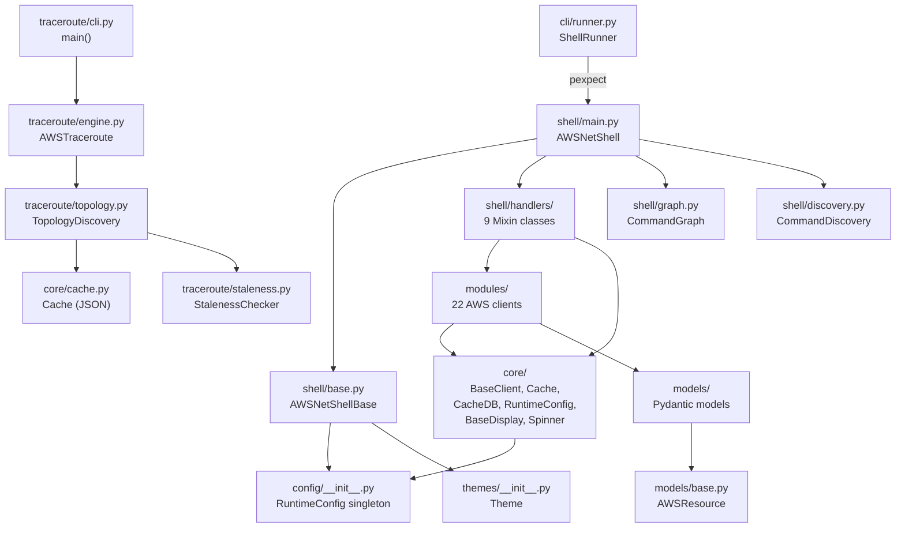

---

## 2. Module Deep-Dives

### 2a. `core/` — Foundation Layer

**Purpose:** Shared infrastructure consumed by every other layer. Provides the AWS client factory, two distinct caches, the `RuntimeConfig` singleton, display utilities, and decorators.

**Key Files**

| File | Lines | Description |
|---|---|---|
| `core/base.py` | 117 | `BaseClient`, `ModuleInterface` ABC, `Context` dataclass, boto3 config |
| `core/cache.py` | 127 | File-backed JSON cache with TTL and account-ID safety |
| `core/cache_db.py` | 308 | SQLite-backed persistent cache for routing and topology data |
| `core/display.py` | 46 | `BaseDisplay` with `route_table()` and `print_cache_info()` |
| `core/renderer.py` | 161 | `DisplayRenderer` — unified Rich table/json/yaml output |
| `core/spinner.py` | 94 | `run_with_spinner()` — TTY-aware spinner wrapper |
| `core/decorators.py` | 91 | `@requires_context`, `@requires_root`, `@cached_command` |
| `core/validators.py` | 198 | `validate_regions()`, `validate_profile()`, `validate_output_format()` |
| `core/ip_resolver.py` | 51 | `IpResolver` — parallel ENI lookup across regions |
| `core/logging.py` | 57 | `setup_logging()`, `get_logger()` — hierarchical logger |

**Public Interface**

```python
# BaseClient — all module clients inherit this
class BaseClient:
    def __init__(self, profile=None, session=None, max_workers=None)
    def client(self, service: str, region_name=None) -> boto3.client
    def get_regions(self) -> list[str]   # respects RuntimeConfig

# ModuleInterface ABC — implemented by every *Module class
class ModuleInterface(ABC):
    @property @abstractmethod
    def name(self) -> str
    @property
    def commands(self) -> Dict[str, str]          # root-level commands
    @property
    def context_commands(self) -> Dict[str, List[str]]
    @property
    def show_commands(self) -> Dict[str, List[str]]
    @abstractmethod
    def execute(self, shell, command: str, args: str)

# Cache — file-backed
class Cache:
    def __init__(self, namespace: str)
    def get(self, ignore_expiry=False, current_account=None) -> Optional[dict]
    def set(self, data, ttl_seconds=None, account_id=None)
    def clear(self)
    def get_info(self) -> Optional[dict]

# CacheDB — SQLite-backed
class CacheDB:
    def save_routing_cache(self, cache_data, profile="default") -> int
    def load_routing_cache(self, profile="default") -> Dict
    def save_topology_cache(self, cache_key, data, profile="default")
    def load_topology_cache(self, cache_key, profile="default") -> Optional[Any]
    def clear_all(self, profile=None)
    def get_stats(self) -> Dict

# run_with_spinner — used widely
def run_with_spinner(func, message="Loading...", timeout_seconds=300, console=None) -> T
```

**Internal Architecture**

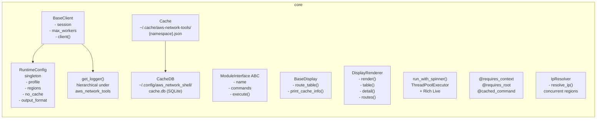

**Dependencies:** `config/__init__.py` (RuntimeConfig), `boto3`, `rich`

**Code sample — how `BaseClient.client()` handles fallback:**

```python
def client(self, service: str, region_name=None):
    try:
        return self.session.client(service, region_name=region_name, config=DEFAULT_BOTO_CONFIG)
    except Exception:
        return self.session.client(service, region_name=region_name)
```

---

### 2b. `config/` — Configuration Management

**Purpose:** Two-tier configuration. `Config` reads/writes a JSON file at `~/.config/aws_network_shell/config.json` for persistent settings (theme, prompt style, output format). `RuntimeConfig` is a thread-safe singleton for settings that change during a session (profile, regions, no-cache flag).

**Key Files**

| File | Lines | Description |
|---|---|---|
| `config/__init__.py` | 203 | Both `Config` and `RuntimeConfig` classes |

**Public Interface**

```python
class Config:
    def get(self, key: str, default=None)    # dot-notation: "prompt.style"
    def set(self, key: str, value)
    def save()
    def get_prompt_style() -> str            # "short" or "long"
    def get_theme_name() -> str
    def show_indices() -> bool
    def get_max_length() -> int

class RuntimeConfig:                          # Thread-safe singleton
    @classmethod def set_profile(cls, profile)
    @classmethod def get_profile(cls) -> Optional[str]
    @classmethod def set_regions(cls, regions)
    @classmethod def get_regions(cls) -> list[str]
    @classmethod def set_no_cache(cls, no_cache)
    @classmethod def is_cache_disabled(cls) -> bool
    @classmethod def set_output_format(cls, format)   # "table"|"json"|"yaml"
    @classmethod def get_output_format(cls) -> str
    @classmethod def reset(cls)                        # test teardown
```

**Config Defaults**

```json
{
  "prompt":  { "style": "short", "theme": "catppuccin", "show_indices": true, "max_length": 50 },
  "display": { "output_format": "table", "colors": true, "pager": false },
  "cache":   { "enabled": true, "expire_minutes": 30 }
}
```

**Mermaid — Configuration propagation**

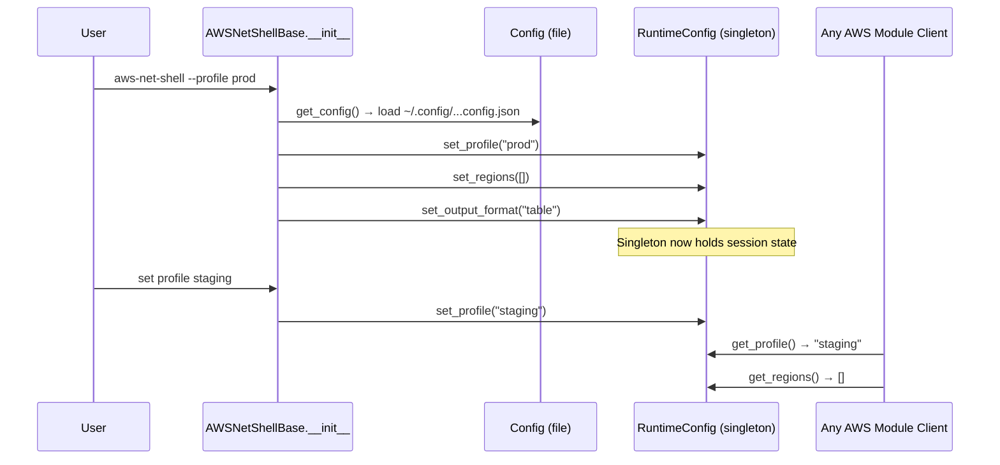

---

### 2c. `models/` — Pydantic Data Models

**Purpose:** Validated data contracts for AWS resources. All models inherit `AWSResource` and use Pydantic v2 for field validation, ID-format enforcement, and dict serialisation.

**Key Files**

| File | Lines | Description |
|---|---|---|
| `models/base.py` | 41 | `AWSResource`, `CIDRBlock` base models |
| `models/vpc.py` | 65 | `VPCModel`, `SubnetModel`, `RouteTableModel`, `SecurityGroupModel`, `RouteModel` |
| `models/tgw.py` | 55 | `TGWModel`, `TGWRouteTableModel`, `TGWAttachmentModel`, `TGWRouteModel` |
| `models/cloudwan.py` | 49 | `CoreNetworkModel`, `SegmentModel`, `CloudWANRouteModel` |
| `models/ec2.py` | 49 | `EC2InstanceModel`, `ENIModel` |

**Class Hierarchy**

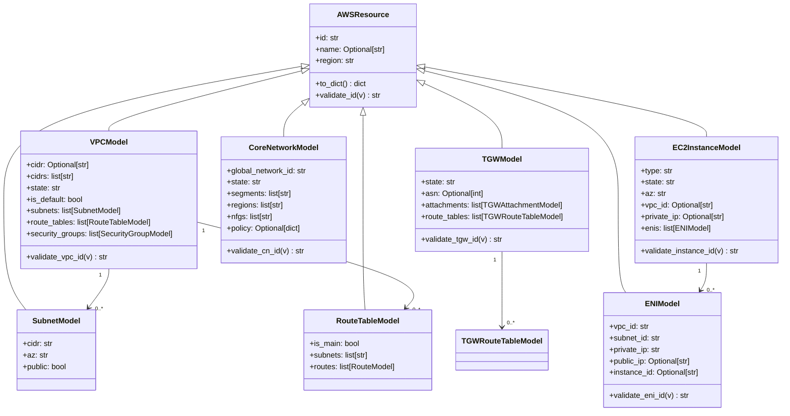

**Note:** In practice, the module clients return plain `dict` objects rather than instantiated Pydantic models. The models serve as documentation contracts and are used in type-annotated paths; `model_config = ConfigDict(extra="allow")` on `AWSResource` permits additional AWS API fields through without validation errors.

---

### 2d. `modules/` — AWS Service Clients

**Purpose:** One file per AWS service. Each file provides (at minimum) a `*Client(BaseClient)` for API calls and a `*Display(BaseDisplay)` for rendering. Most also provide a `*Module(ModuleInterface)` for integration with the plugin-style registration system (partially used).

**Module Inventory**

| File | Lines | Complexity | AWS Service | Key Classes |
|---|---|---|---|---|
| `cloudwan.py` | 1382 | High | Network Manager / Cloud WAN | `CloudWANClient`, `CloudWANDisplay`, `CloudWANModule` |
| `vpc.py` | 697 | High | EC2/VPC | `VPCClient`, `VPCDisplay`, `VPCModule` |
| `tgw.py` | 479 | High | EC2/TGW | `TGWClient`, `TGWDisplay`, `TGWModule` |
| `anfw.py` | 488 | Medium | Network Firewall | `ANFWClient`, `ANFWDisplay`, `ANFWModule` |
| `elb.py` | 586 | Medium | ELBv2 | `ELBClient`, `ELBDisplay`, `ELBModule` |
| `security.py` | 449 | Medium | EC2 Security Groups | `SecurityClient`, `SecurityModule` |
| `direct_connect.py` | 428 | Medium | Direct Connect | `DXClient`, `DXDisplay`, `DXModule` |
| `reachability.py` | 264 | Medium | EC2 Reachability Analyzer | `ReachabilityClient` |
| `client_vpn.py` | 350 | Medium | Client VPN | `ClientVPNClient` |
| `global_accelerator.py` | 314 | Medium | Global Accelerator | `GAClient` |
| `privatelink.py` | 371 | Medium | VPC Endpoints / PrivateLink | `PrivateLinkClient` |
| `route53_resolver.py` | 271 | Medium | Route53 Resolver | `R53ResolverClient` |
| `flowlogs.py` | 301 | Medium | VPC Flow Logs | `FlowLogsClient` |
| `network_alarms.py` | 311 | Medium | CloudWatch Alarms | `NetworkAlarmsClient` |
| `vpn.py` | 281 | Medium | Site-to-Site VPN | `VPNClient`, `VPNDisplay`, `VPNModule` |
| `ec2.py` | 254 | Simple | EC2 Instances | `EC2Client` |
| `eni.py` | 165 | Simple | ENIs | `ENIClient`, `ENIDisplay` |
| `peering.py` | 178 | Simple | VPC Peering | `PeeringClient` |
| `prefix_lists.py` | 174 | Simple | Managed Prefix Lists | `PrefixListClient` |
| `ip_finder.py` | 186 | Simple | IP→Resource lookup | `IPFinderClient` |
| `org.py` | ~50 | Simple | AWS Organizations | `OrgClient` |
| `traceroute.py` | ~50 | Simple | Shell-side trace bridge | bridge only |

**Pattern: Client + Display + Module**

Every substantial module follows this three-class pattern:

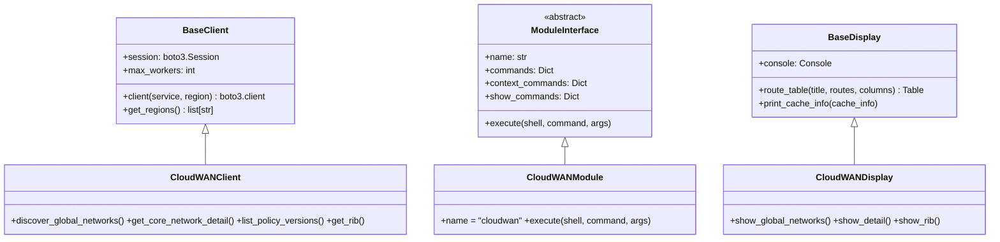

**CloudWAN — the most complex module**

`cloudwan.py` (1,382 lines) handles three levels of AWS Network Manager API:

1. Global Networks (`describe_global_networks`)
2. Core Networks — policy documents, segments, edge locations, NFGs
3. Route tables — per-segment RIBs, blackhole detection, fuzzy prefix search (`thefuzz`)

Key methods on `CloudWANClient`:

```python
def discover_global_networks(self) -> list[dict]
def get_core_network_detail(self, cn_id: str) -> dict   # includes live policy
def list_policy_versions(self, cn_id: str) -> list[dict]
def get_core_network_policy(self, cn_id: str, version=None) -> dict
def get_rib(self, cn_id: str, segment: str, edge: str) -> list[dict]
def list_attachments(self, cn_id: str) -> list[dict]
def list_connect_attachments(self, cn_id: str) -> list[dict]
def list_connect_peers(self, cn_id: str) -> list[dict]
```

**VPC and TGW — multi-region concurrent discovery**

Both `VPCClient.discover()` and `TGWClient.discover()` use the same pattern:

```python
def discover(self, regions=None) -> list[dict]:
    regions = regions or self.get_regions()
    with ThreadPoolExecutor(max_workers=self.max_workers) as ex:
        futures = {ex.submit(self._scan_region, r): r for r in regions}
        for f in as_completed(futures):
            results.extend(f.result())
    return sorted(results, ...)
```

---

### 2e. `shell/` — Interactive Shell

**Purpose:** Builds the interactive REPL by composing `AWSNetShellBase` (cmd2 subclass) with nine handler mixins into `AWSNetShell`. The base class owns the context stack, prompt rendering, and HIERARCHY definition. `main.py` wires them together and provides `do_show` / `do_set` dispatch.

**Key Files**

| File | Lines | Description |
|---|---|---|
| `shell/base.py` | 619 | `AWSNetShellBase` — context stack, prompt, HIERARCHY dict, navigation |
| `shell/main.py` | 427 | `AWSNetShell` — composes all mixins, `do_show`, `do_set`, `_cached()` |
| `shell/graph.py` | 711 | `CommandGraph` — validates HIERARCHY against implemented handlers, Mermaid export |
| `shell/discovery.py` | 171 | `CommandDiscovery` — derives list/set commands from HIERARCHY dynamically |
| `shell/arguments.py` | 119 | `ArgumentRegistry` — test argument registry for CI invocations |

**AWSNetShell Mixin Composition**

```mermaid
classDiagram
    class cmd2_Cmd {
        <<framework>>
        +cmdloop()
        +precmd()
        +default()
    }
    class AWSNetShellBase {
        +context_stack: list[Context]
        +profile: str
        +regions: list[str]
        +_cache: dict
        +_enter(ctx_type, id, name, data)
        +_resolve(items, val) dict
        +_update_prompt()
        +do_exit() 
        +do_end()
        +do_refresh()
        +HIERARCHY: dict
    }
    class RootHandlersMixin { +_show_vpcs() +_show_transit_gateways() +_show_global_networks() +_set_profile() +_set_regions() }
    class CloudWANHandlersMixin { +_show_segments() +_show_rib() +_show_policy_documents() +_show_connect_attachments() }
    class VPCHandlersMixin { +_set_vpc() +_show_vpc_route_tables() +_show_subnets() }
    class TGWHandlersMixin { +_set_transit_gateway() +_show_transit_gateway_route_tables() }
    class EC2HandlersMixin { +_set_ec2_instance() +_show_enis() +_show_security_groups() }
    class FirewallHandlersMixin { +_set_firewall() +_show_rule_groups() }
    class VPNHandlersMixin { +_set_vpn() +_show_tunnels() }
    class ELBHandlersMixin { +_set_elb() +_show_listeners() +_show_targets() }
    class UtilityHandlersMixin { +do_trace() +do_find_ip() +do_write() +do_populate_cache() }
    class AWSNetShell {
        +_cached(key, fetch_fn, msg) 
        +_emit_json_or_table(data, fn)
        +do_show(args)
        +do_set(args)
        +do_find_prefix(args)
        +do_find_null_routes()
    }

    cmd2_Cmd <|-- AWSNetShellBase
    AWSNetShellBase <|-- AWSNetShell
    RootHandlersMixin <|-- AWSNetShell
    CloudWANHandlersMixin <|-- AWSNetShell
    VPCHandlersMixin <|-- AWSNetShell
    TGWHandlersMixin <|-- AWSNetShell
    EC2HandlersMixin <|-- AWSNetShell
    FirewallHandlersMixin <|-- AWSNetShell
    VPNHandlersMixin <|-- AWSNetShell
    ELBHandlersMixin <|-- AWSNetShell
    UtilityHandlersMixin <|-- AWSNetShell
```

**HIERARCHY dict (abridged)**

The `HIERARCHY` dict in `base.py` is the single source of truth for what commands are valid at each context level. `CommandDiscovery` and `CommandGraph` both read from it.

```python
HIERARCHY = {
    None: {                          # Root level
        "show": ["vpcs", "transit_gateways", "global-networks", ...],
        "set":  ["vpc", "transit-gateway", "global-network", "profile", "regions", ...],
        "commands": ["show", "set", "trace", "find_ip", ...],
    },
    "vpc": {
        "show": ["detail", "route-tables", "subnets", "security-groups", ...],
        "set":  ["route-table"],
        "commands": ["show", "set", "find_prefix", "find_null_routes", "exit", "end"],
    },
    "core-network": {
        "show": ["segments", "rib", "route-tables", "policy-documents", ...],
        "set":  ["route-table"],
        "commands": ["show", "set", "find_prefix", "find_null_routes", "exit", "end"],
    },
    # ... transit-gateway, firewall, ec2-instance, elb, vpn, route-table
}
```

**`_cached()` — in-session memory cache**

```python
def _cached(self, key: str, fetch_fn, msg: str = "Loading..."):
    if key not in self._cache or self.no_cache:
        self._cache[key] = run_with_spinner(fetch_fn, msg)
    return self._cache[key]
```

This `dict`-based in-memory cache (`self._cache`) is the primary cache layer within a shell session. It is separate from the file-backed `Cache` class.

---

### 2f. `shell/handlers/` — Handler Mixins

**Purpose:** Each mixin implements the `_show_*` and `_set_*` methods for a specific domain. They call module clients and use `self._cached()` for in-session caching.

| Mixin | File | Lines | Owns |
|---|---|---|---|
| `RootHandlersMixin` | `handlers/root.py` | 1257 | All root-level `show` and `set` handlers; routing cache management |
| `CloudWANHandlersMixin` | `handlers/cloudwan.py` | 544 | Cloud WAN context: segments, RIB, policy versions, attachments |
| `VPCHandlersMixin` | `handlers/vpc.py` | 365 | VPC context: route tables, subnets, NACLs, security groups |
| `TGWHandlersMixin` | `handlers/tgw.py` | ~200 | TGW context: route tables, attachments |
| `EC2HandlersMixin` | `handlers/ec2.py` | ~200 | EC2 instance context: ENIs, security groups, routes |
| `FirewallHandlersMixin` | `handlers/firewall.py` | 232 | Firewall context: rule groups, policy |
| `VPNHandlersMixin` | `handlers/vpn.py` | ~180 | VPN context: tunnel status |
| `ELBHandlersMixin` | `handlers/elb.py` | 162 | ELB context: listeners, target groups, health |
| `UtilityHandlersMixin` | `handlers/utilities.py` | 231 | `trace`, `find_ip`, `write`, `populate_cache` |

**Handler naming convention**

`do_show` in `main.py` resolves `show <opt>` to `_show_<opt_with_underscores>`. For example, `show transit_gateways` → `_show_transit_gateways()`. The `set` dispatcher mirrors this: `set vpc` → `_set_vpc()`.

---

### 2g. `shell/graph.py` and `shell/discovery.py`

**Purpose:** Structural integrity tools for the command hierarchy.

`CommandGraph` (711 lines) introspects the live `AWSNetShell` class using `inspect.getmembers` and cross-references every `_show_*` and `_set_*` method against `HIERARCHY`. It produces `ValidationResult` objects and can export the full command tree as Mermaid.

`CommandDiscovery` (171 lines) derives the `show <plural>` and `set <type>` commands from `HIERARCHY` at import time, eliminating hardcoded string mappings elsewhere. Used primarily by test infrastructure.

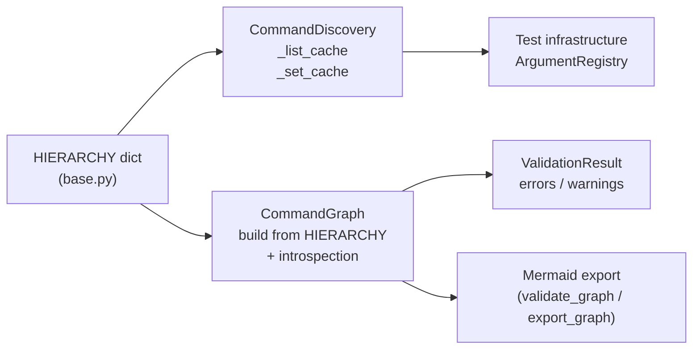

---

### 2h. `traceroute/` — Path Tracing Engine

**Purpose:** Determines the logical network path between two IP addresses by walking the AWS topology — VPC route tables → TGW route tables → Cloud WAN segments — without sending real packets. Uses `asyncio` internally with `ThreadPoolExecutor` for parallel API calls.

**Key Files**

| File | Lines | Description |
|---|---|---|
| `traceroute/engine.py` | 462 | `AWSTraceroute` — async trace algorithm |
| `traceroute/topology.py` | 286 | `TopologyDiscovery`, `NetworkTopology` dataclass |
| `traceroute/staleness.py` | 176 | `StalenessChecker`, `ChangeMarkers` — lightweight stale detection |
| `traceroute/models.py` | 59 | `Hop`, `SecurityCheck`, `TraceResult` dataclasses |
| `traceroute/cli.py` | 82 | `main()` — `aws-trace` entry point |

**Data Models**

```python
@dataclass
class Hop:
    seq: int
    type: HopType   # "eni"|"route_table"|"cloud_wan_segment"|"nfg"|"firewall"|"destination"
    id: str
    name: str
    region: str
    detail: dict

@dataclass
class TraceResult:
    src_ip: str
    dst_ip: str
    reachable: bool
    hops: list[Hop]
    security_checks: list[SecurityCheck]
    blocked_at: Hop | None
    blocked_reason: str
    def summary() -> str
```

**NetworkTopology — in-memory topology snapshot**

```python
@dataclass
class NetworkTopology:
    account_id: str
    regions: list[str]
    global_networks: list[dict]
    core_networks: list[dict]
    cwan_attachments: list[dict]
    cwan_policy: dict
    tgws: dict[str, list[dict]]           # region -> list
    tgw_route_tables: dict[str, list[dict]]
    vpcs: dict[str, list[dict]]           # region -> list
    route_tables: dict[str, dict]         # subnet_id -> {id, name, routes}
    eni_index: dict[str, dict]            # ip -> {eni_id, vpc_id, subnet_id, region}
```

**Trace algorithm flow**

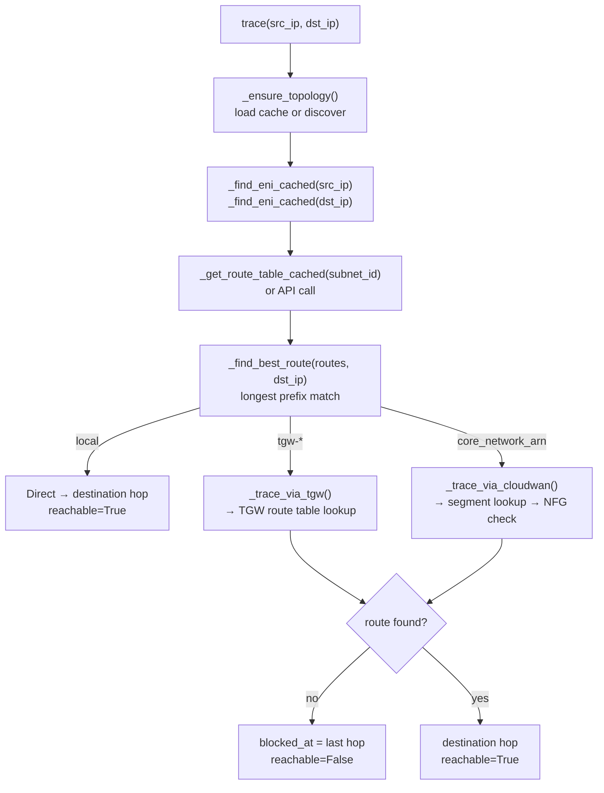

**Staleness detection**

`StalenessChecker` saves `ChangeMarkers` (Cloud WAN policy version, attachment count, TGW/VPC counts per region) alongside the topology cache. On next load, it compares 5–10 fast API calls against the saved markers and triggers a full re-discover only if something changed.

---

### 2i. `themes/` — Theme System

**Purpose:** Maps context types to Rich color strings for prompt rendering.

**Key File:** `themes/__init__.py` (134 lines)

Built-in themes: `dracula`, `catppuccin-latte`, `catppuccin-macchiato`, `catppuccin-mocha` (default). Custom themes load from `~/.aws_network_shell/themes/<name>.json`.

```python
class Theme:
    def __init__(self, name: str, colors: Dict[str, str])
    def get(self, key: str, default="white") -> str

def load_theme(name: Optional[str] = None) -> Theme
```

Color keys: `global-network`, `core-network`, `route-table`, `vpc`, `transit-gateway`, `firewall`, `elb`, `vpn`, `ec2-instance`, `prompt_separator`, `prompt_text`.

---

### 2j. `cli/runner.py` — Automation Runner

**Purpose:** Drives the interactive shell non-interactively via `pexpect`. Useful for scripting sequences of commands (e.g., CI topology checks) without a TTY.

```python
class ShellRunner:
    def __init__(self, profile=None, timeout=60)
    def start()                             # spawns aws-net-shell subprocess
    def run(command: str) -> str            # sends command, returns cleaned output
    def run_sequence(commands: list[str])
    def close()
```

The runner strips ANSI codes, waits for prompt stability (3 stable reads ~0.3s), and handles spinners transparently.

---

## 3. Interface Descriptions

### ModuleInterface ABC

Every `*Module` class must implement `name` and `execute()`. The `commands`, `context_commands`, and `show_commands` properties document what the module provides but are not actively consumed by the shell dispatch loop in the current architecture — the shell uses the `HIERARCHY` dict and method introspection instead. These properties are more documentation than enforcement.

```python
class ModuleInterface(ABC):
    @property @abstractmethod
    def name(self) -> str

    @property
    def commands(self) -> Dict[str, str]:           # {cmd: help_text}
        return {}

    @property
    def context_commands(self) -> Dict[str, List[str]]:
        return {}

    @property
    def show_commands(self) -> Dict[str, List[str]]:
        return {}

    @abstractmethod
    def execute(self, shell: Any, command: str, args: str):
        pass
```

### BaseClient Interface

`BaseClient` guarantees every subclass has:
- A `boto3.Session` with optional profile
- A `client(service, region)` factory that applies standard retries (10 attempts, standard mode), connect timeout (5s), read timeout (20s)
- `get_regions()` that respects `RuntimeConfig` first, then falls back to the session's default region
- `max_workers` (default: 10, overridable via `AWS_NET_MAX_WORKERS` env var)

### BaseDisplay Interface

`BaseDisplay` is a thin wrapper. Subclasses receive a `Console` and call `self.console.print(...)` directly. The `route_table()` helper builds a Rich `Table` from a list of route dicts and a column spec `[(name, style, dict_key), ...]`.

### Cache Interface

Two distinct cache mechanisms exist:

| | `Cache` (file) | `CacheDB` (SQLite) |
|---|---|---|
| Location | `~/.cache/aws-network-tools/<ns>.json` | `~/.config/aws_network_shell/cache.db` |
| TTL | Yes (default 900s) | No built-in TTL |
| Account safety | Yes (clears on account ID mismatch) | Per-profile keying |
| Use case | Topology, per-module data | Routing cache, traceroute topology |
| Used by | Modules, topology discovery | Routing cache commands, CacheDB explicitly |

The in-session `self._cache: dict` in `AWSNetShellBase` is a third, ephemeral layer that lives only for the duration of a shell session.

### Shell ↔ Handlers ↔ Modules ↔ AWS

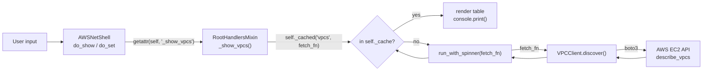

### Context Stack Protocol

`_enter(ctx_type, ref, name, data, selection_index)` pushes a `Context` onto `self.context_stack`. `do_exit()` pops one level; `do_end()` clears the stack. `self.hierarchy` always returns the HIERARCHY entry for the current `ctx_type`, so `do_show` and `do_set` automatically validate against the correct allowed commands.

```
aws-net> set global-network 1          # push Context("global-network", ...)
aws-net>gl:1> set core-network 1       # push Context("core-network", ...)
aws-net>gl:1>cn:1> show rib            # valid: rib is in core-network show list
aws-net>gl:1>cn:1> exit                # pop to global-network
aws-net>gl:1> end                      # clear stack → root
aws-net>
```

---

## 4. Data Flow Diagrams

### Command Execution Pipeline

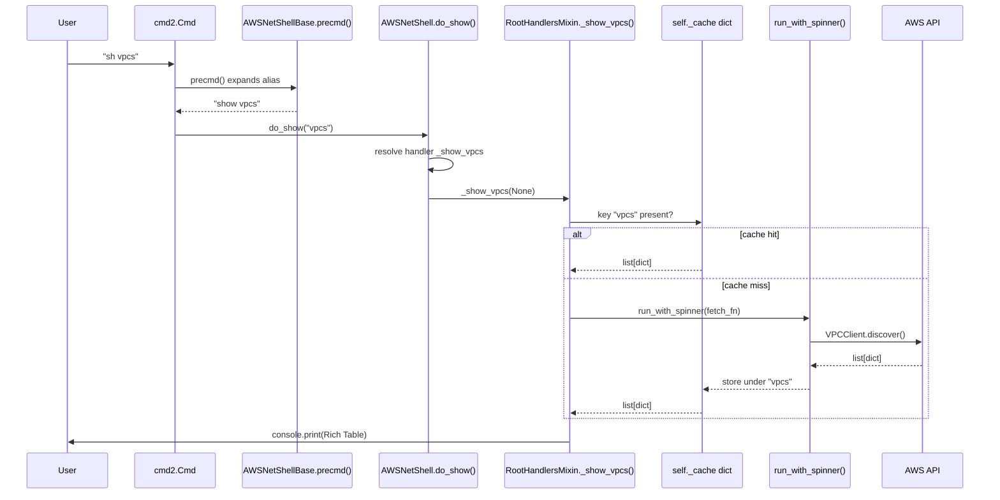

### Resource Discovery Flow

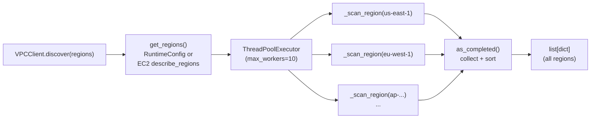

### Cache Lookup Chain

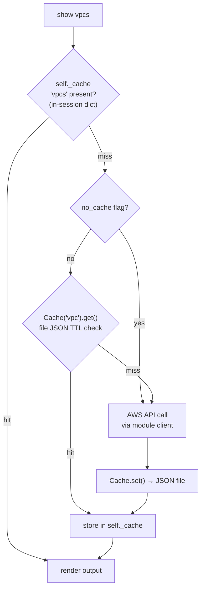

### Context Navigation Flow

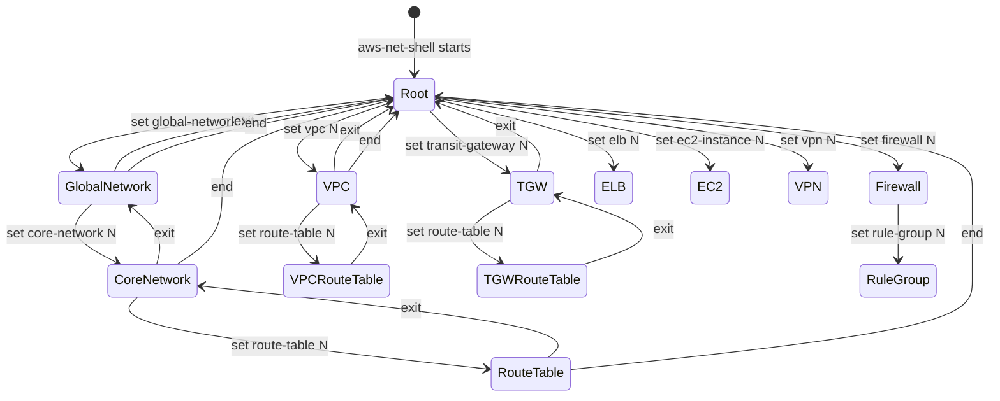

### Traceroute Execution Flow

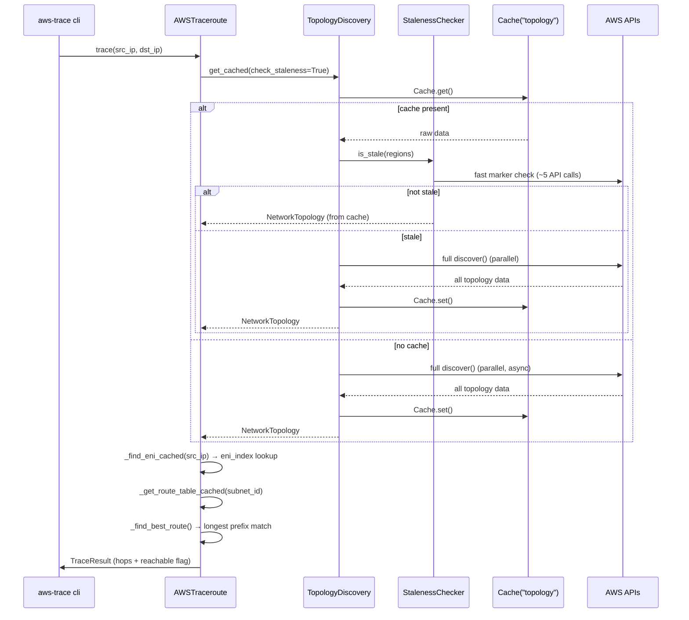

---

## 5. Cross-Cutting Concerns

### Error Handling

There is no custom exception hierarchy. The pattern used throughout is:

1. **Module clients** — wrap API calls in `try/except Exception`, log with `logger.warning(...)`, and return empty lists or `None` rather than propagating.
2. **Shell handlers** — check return values and print Rich-formatted `[red]...[/]` or `[yellow]...[/]` messages to the console.
3. **Cache misses** — treated as `None`; callers always check before use.
4. **Boto3 fallback** — `BaseClient.client()` catches config failures and retries without the custom config.

### Logging Architecture

```
aws_network_tools          ← root logger (logging.getLogger("aws_network_tools"))
├── aws_network_tools.cloudwan
├── aws_network_tools.vpc
├── aws_network_tools.tgw
├── aws_network_tools.shell.root
└── ...
```

`setup_logging(debug, log_file)` in `core/logging.py` configures handlers. At runtime, only `WARNING+` goes to stderr unless `--debug` is passed. Each module calls `get_logger("module_name")` to get a child logger. The shell doesn't call `setup_logging` by default — callers are responsible for configuration.

### Concurrency Model

Two concurrency mechanisms are used:

| Mechanism | Where | Purpose |
|---|---|---|
| `ThreadPoolExecutor` (sync) | `modules/*.py`, `core/ip_resolver.py` | Parallel region scanning in `discover()` |
| `asyncio` + `ThreadPoolExecutor` | `traceroute/engine.py`, `traceroute/topology.py` | Traceroute topology discovery |
| `run_with_spinner()` | Shell handlers | Runs any blocking call in a background thread with a live spinner |

The shell itself is single-threaded (cmd2 REPL). All blocking AWS calls are off-loaded to threads via `run_with_spinner()`. The traceroute engine is the only consumer of `asyncio`.

### RuntimeConfig Singleton Propagation

`RuntimeConfig` uses the classic double-checked locking singleton pattern. The shell sets it once during `__init__` and again via `_sync_runtime_config()` whenever the user changes `profile`, `regions`, or `no-cache`. Module clients call `RuntimeConfig.get_profile()` and `RuntimeConfig.get_regions()` in their constructors, so they always receive the current session state without the shell needing to pass these values explicitly.

```mermaid
flowchart LR
    SHELL["AWSNetShell\nset profile prod"] -->|RuntimeConfig.set_profile| RC["RuntimeConfig\nsingleton\n_instance"]
    RC -->|get_profile()| M1["VPCClient.__init__"]
    RC -->|get_profile()| M2["TGWClient.__init__"]
    RC -->|get_regions()| M3["ANFWClient.discover()"]
    RC -->|is_cache_disabled()| M4["Any module client"]
```

---

## 6. Class Diagrams

### BaseClient Inheritance

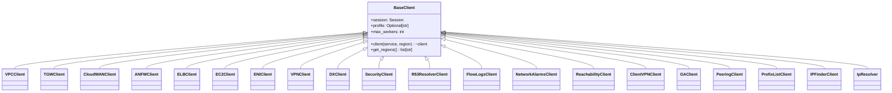

### Pydantic Model Hierarchy

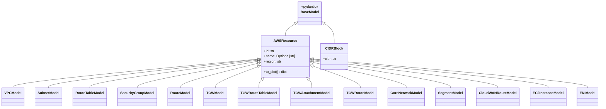

### Shell Mixin Composition (MRO order)

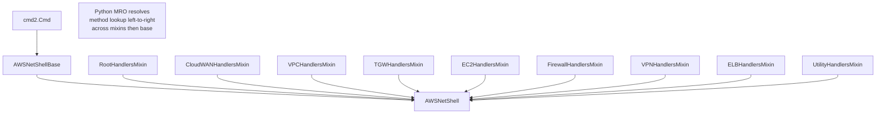

### ModuleInterface Implementations

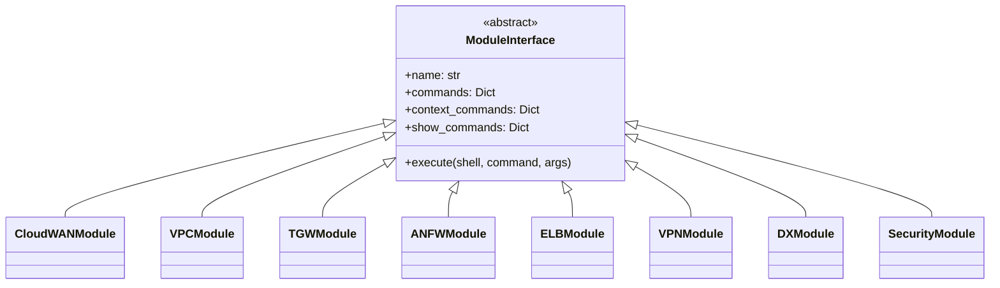

---

## Appendix: File Index

| File | Lines | Role |
|---|---|---|
| `__init__.py` | 3 | Package version |
| `cli.py` | 842 | Legacy CLI entry (pre-runner) |
| `cli/runner.py` | 174 | `ShellRunner` automation driver |
| `config/__init__.py` | 203 | `Config` + `RuntimeConfig` |
| `core/base.py` | 117 | `BaseClient`, `ModuleInterface`, `Context` |
| `core/cache.py` | 127 | `Cache` (file-backed, TTL) |
| `core/cache_db.py` | 308 | `CacheDB` (SQLite) |
| `core/decorators.py` | 91 | `@requires_context`, `@requires_root` |
| `core/display.py` | 46 | `BaseDisplay` |
| `core/ip_resolver.py` | 51 | `IpResolver` |
| `core/logging.py` | 57 | `setup_logging`, `get_logger` |
| `core/renderer.py` | 160 | `DisplayRenderer` |
| `core/spinner.py` | 94 | `run_with_spinner` |
| `core/validators.py` | 198 | Region/profile/format validators |
| `models/base.py` | 41 | `AWSResource`, `CIDRBlock` |
| `models/cloudwan.py` | 49 | CloudWAN Pydantic models |
| `models/ec2.py` | 49 | EC2/ENI Pydantic models |
| `models/tgw.py` | 55 | TGW Pydantic models |
| `models/vpc.py` | 65 | VPC Pydantic models |
| `modules/anfw.py` | 488 | AWS Network Firewall client |
| `modules/client_vpn.py` | 350 | Client VPN client |
| `modules/cloudwan.py` | 1382 | Cloud WAN client (most complex) |
| `modules/direct_connect.py` | 428 | Direct Connect client |
| `modules/ec2.py` | 254 | EC2 instance client |
| `modules/elb.py` | 586 | ELBv2 client |
| `modules/eni.py` | 165 | ENI client |
| `modules/flowlogs.py` | 301 | VPC Flow Logs client |
| `modules/global_accelerator.py` | 314 | Global Accelerator client |
| `modules/ip_finder.py` | 186 | IP→resource lookup |
| `modules/network_alarms.py` | 311 | CloudWatch alarms client |
| `modules/org.py` | ~50 | AWS Organizations client |
| `modules/peering.py` | 178 | VPC Peering client |
| `modules/prefix_lists.py` | 174 | Managed Prefix Lists client |
| `modules/privatelink.py` | 371 | PrivateLink / VPC Endpoints client |
| `modules/reachability.py` | 264 | Reachability Analyzer client |
| `modules/route53_resolver.py` | 271 | Route53 Resolver client |
| `modules/security.py` | 449 | Security Group analysis client |
| `modules/tgw.py` | 479 | Transit Gateway client |
| `modules/traceroute.py` | ~50 | Shell-side traceroute bridge |
| `modules/vpc.py` | 697 | VPC client |
| `modules/vpn.py` | 281 | Site-to-Site VPN client |
| `shell/arguments.py` | 119 | `ArgumentRegistry` for test args |
| `shell/base.py` | 619 | `AWSNetShellBase` — HIERARCHY, context stack, prompt |
| `shell/discovery.py` | 171 | `CommandDiscovery` — dynamic command derivation |
| `shell/graph.py` | 711 | `CommandGraph` — validation + Mermaid export |
| `shell/main.py` | 427 | `AWSNetShell` — composed shell + dispatch |
| `shell/handlers/cloudwan.py` | 544 | CloudWAN context handlers |
| `shell/handlers/ec2.py` | ~200 | EC2 context handlers |
| `shell/handlers/elb.py` | 162 | ELB context handlers |
| `shell/handlers/firewall.py` | 232 | Firewall context handlers |
| `shell/handlers/root.py` | 1257 | Root-level handlers |
| `shell/handlers/tgw.py` | ~200 | TGW context handlers |
| `shell/handlers/utilities.py` | 231 | Utility command handlers |
| `shell/handlers/vpc.py` | 365 | VPC context handlers |
| `shell/handlers/vpn.py` | ~180 | VPN context handlers |
| `themes/__init__.py` | 134 | Theme system |
| `traceroute/cli.py` | 82 | `aws-trace` entry point |
| `traceroute/engine.py` | 462 | `AWSTraceroute` async engine |
| `traceroute/models.py` | 59 | `Hop`, `TraceResult` dataclasses |
| `traceroute/staleness.py` | 176 | `StalenessChecker` |
| `traceroute/topology.py` | 286 | `TopologyDiscovery`, `NetworkTopology` |
