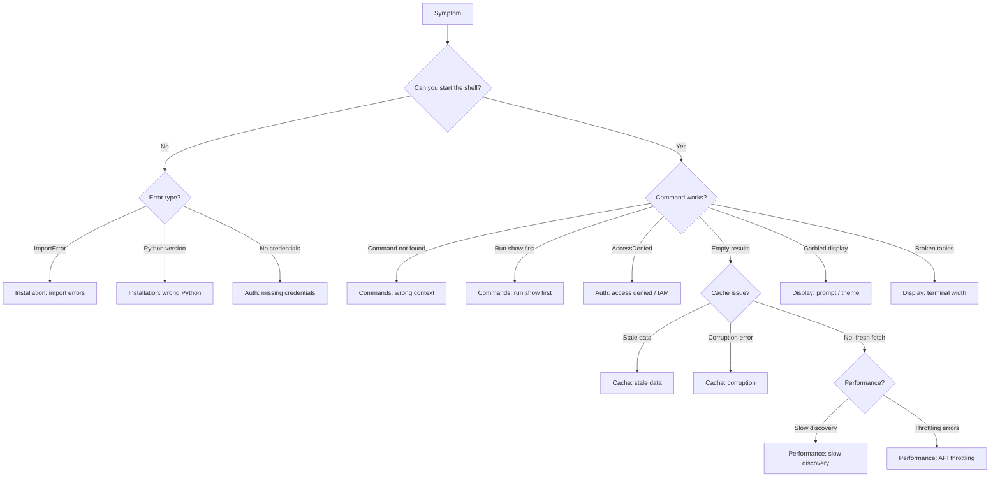
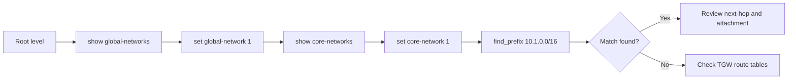

# AWS Network Shell - Runbook

Operational reference for `aws-net-shell`. Covers common issues, procedures, IAM requirements, and diagnostic commands.

**Entry points:**
- `aws-net-shell` - Interactive Cisco IOS-style shell
- `aws-net-runner` - Non-interactive CLI
- `aws-trace` - Traceroute CLI

---

## 1. Troubleshooting Decision Tree



---

## 2. Common Issues

### Installation

| Symptom | Cause | Fix |
|---------|-------|-----|
| `ImportError: cannot import name 'X'` | Incomplete install or editable install not rebuilt | `uv pip install -e .` from project root |
| `ModuleNotFoundError: aws_network_tools` | Wrong venv or package not installed | Activate correct venv; `uv pip install -e .` |
| `python: command not found` / wrong version | Python < 3.10 | Requires Python >= 3.10; use `asdf` or `pyenv` to switch |
| `NoCredentialsError` on startup | No AWS credentials configured | Run `aws configure` or set `AWS_PROFILE` env var |

### Authentication

| Symptom | Cause | Fix |
|---------|-------|-----|
| `AccessDeniedException` on any command | Insufficient IAM permissions | Check [IAM Permissions](#4-required-iam-permissions) section |
| Results from wrong account after profile switch | File cache from prior account not cleared | `refresh all` or `clear_cache` in shell; old account ID triggers auto-clear on next fetch |
| `AWS_PROFILE` switch has no effect | RuntimeConfig already initialised | `set profile <name>` inside shell, or restart shell |
| `ExpiredTokenException` | SSO/assumed-role token expired | `aws sso login --profile <name>` or `aws sts assume-role` to refresh |

### Performance

| Symptom | Cause | Fix |
|---------|-------|-----|
| Discovery takes > 60 s | All-region scan with many resources | `set regions us-east-1,eu-west-1` to scope; or `set no-cache off` to use cache |
| `ThrottlingException` in logs | Too many concurrent API calls | Reduce `AWS_NET_MAX_WORKERS` (default 10); e.g. `export AWS_NET_MAX_WORKERS=3` |
| High memory during `populate_cache` | Large topology loaded in-memory | Run during off-peak; use `set regions` to limit scope |

### Cache

| Symptom | Cause | Fix |
|---------|-------|-----|
| Stale resources shown (deleted VPCs, etc.) | TTL not expired (default 15 min file / 30 min config) | `refresh all` or `refresh <resource>` to force re-fetch |
| `json.JSONDecodeError` on start | Corrupt file cache JSON | Delete `~/.cache/aws-network-tools/*.json` |
| File cache growing large | Many namespaces cached over time | `rm ~/.cache/aws-network-tools/*.json` then repopulate |
| `database is locked` error | SQLite write collision (routing cache) | Stop concurrent shell instances; `rm ~/.config/aws_network_shell/cache.db` |

### Commands

| Symptom | Cause | Fix |
|---------|-------|-----|
| `Unknown command: show vpcs` inside a context | Command not valid at current context level | Type `?` to see available commands; use `end` to return to root |
| `run show first` error | Command needs context resource set first | Run `show vpcs` then `set vpc 1` before context commands |
| `No ENI found for <ip>` | IP not in any scanned region | Verify regions with `show regions`; add region with `set regions` |
| Pipe filter returns nothing | Pattern is case-sensitive by default | Pipe filter is case-insensitive; check pattern spelling |

### Display

| Symptom | Cause | Fix |
|---------|-------|-----|
| Tables truncated / columns missing | Terminal too narrow | Widen terminal; `set output-format json` for raw data |
| ANSI escape codes in prompt (garbled) | Non-256-colour terminal | `set theme default`; or set `NO_SPINNER=1` to reduce decorations |
| Theme colours wrong / unreadable | Dark theme on light terminal | `set theme catppuccin-latte` for light backgrounds |

---

## 3. Runbook Procedures

### RB-01: Pre-Session Health Check

**Purpose:** Verify credentials, config, and cache before starting work.

1. Check AWS identity: `aws sts get-caller-identity --profile <name>`
2. Start shell: `aws-net-shell`
3. Verify profile and regions: `show config`
4. Confirm cache status: `show cache`
5. If cache is stale or from wrong account: `refresh all`
6. Check version: `show version`

**Verification:** Prompt shows `aws-net>` with no errors; `show config` reflects expected profile.

---

### RB-02: Warm Cache for Demo

**Purpose:** Pre-load all topology data to avoid discovery delays during a presentation.

1. Start shell: `aws-net-shell`
2. Set scope: `set profile <name>` and `set regions us-east-1,eu-west-1`
3. Run: `populate_cache`
4. Monitor progress output (discovery messages print as each resource type loads)
5. Verify: `show cache` - all entries should show recent timestamps

**Verification:** Subsequent `show vpcs` / `show transit_gateways` return instantly with `Using cached data`.

---

### RB-03: Generate Network Inventory

**Purpose:** Export full inventory of VPCs, TGWs, firewalls to a file.

1. `set output-format json`
2. `set output-file /tmp/inventory.json`
3. `show vpcs`
4. `show transit_gateways`
5. `show firewalls`
6. `set output-format table` (restore)
7. Review output: `cat /tmp/inventory.json`

**Verification:** File exists and contains JSON arrays for each resource type.

---

### RB-04: Monitor VPN Tunnels Continuously

**Purpose:** Watch VPN tunnel state in real time.

1. `set watch 30` (refresh every 30 seconds)
2. `show vpns`
3. Enter VPN context: `set vpn 1`
4. `show tunnels`
5. Watch updates automatically every 30 s
6. To stop: `set watch 0`

**Verification:** Table refreshes on schedule; `Status` column shows `UP`/`DOWN` per tunnel.

---

### RB-05: Investigate Routing Issue (Prefix Lookup)

**Purpose:** Find which route table(s) match a given CIDR prefix.



1. `show global-networks` → `set global-network 1`
2. `show core-networks` → `set core-network 1`
3. `find_prefix 10.1.0.0/16`
4. If not found in Cloud WAN: `end` → `show transit_gateways` → `set transit-gateway 1`
5. `show route-tables` → `set route-table 1` → `find_prefix 10.1.0.0/16`

**Verification:** Matching route entry appears with attachment ID and next-hop type.

---

### RB-06: Clear All Caches and Reset

**Purpose:** Full reset when data is stale, corrupt, or from the wrong account.

1. Inside shell: `refresh all` (clears in-memory shell cache)
2. Exit shell: `exit`
3. Delete file cache: `rm ~/.cache/aws-network-tools/*.json`
4. Delete SQLite routing cache: `rm ~/.config/aws_network_shell/cache.db`
5. Delete file cache config: `rm ~/.cache/aws-network-tools/config.json`
6. Restart shell and verify: `show cache` should show empty

**Verification:** No `Using cached data` messages on next `show` command.

---

### RB-07: Diagnose Connectivity Between Two IPs

**Purpose:** Determine whether two IPs can communicate and which AWS constructs sit between them.

1. Find source resource: `find_ip 10.1.2.3`
2. Note the VPC ID, subnet, and ENI
3. Find destination resource: `find_ip 10.2.3.4`
4. Set source VPC context: `set vpc <vpc-id>`
5. `show route-tables` - check for route to destination CIDR
6. `show security-groups` - check for egress rules to destination
7. `show nacls` - verify subnet-level allow rules
8. Use traceroute: `trace 10.1.2.3 10.2.3.4`

**Verification:** `trace` output shows hop path or identifies blocking point.

---

### RB-08: Find and Investigate Null Routes

**Purpose:** Identify blackhole/null routes that may be dropping traffic.

1. At root: `show transit_gateways` → `set transit-gateway 1`
2. `show route-tables` → `set route-table 1`
3. `find_null_routes`
4. Review output - each null route shows prefix and attachment context
5. For Cloud WAN: `set core-network 1` → `show blackhole-routes`

**Verification:** Null routes listed with prefix; cross-reference against expected routing policy.

---

### RB-09: Check Firewall Rules Blocking Traffic

**Purpose:** Inspect AWS Network Firewall rule groups for a given firewall.

1. `show firewalls` - identify the relevant firewall
2. `set firewall 1`
3. `show firewall-rule-groups` - list all rule groups attached
4. `set rule-group 1`
5. `show rule-group` - inspect stateless/stateful rules
6. Look for DENY or DROP actions matching the source/destination pair

**Verification:** Rule group display shows matching rule with action type.

---

### RB-10: Debug a Failing Command

**Purpose:** Capture verbose debug output for a command that produces no results or an error.

1. Start shell with debug logging:
   ```
   aws-net-shell --debug --log-file /tmp/aws_net_debug_$(date +%s).log
   ```
2. Reproduce the failing command
3. Exit shell
4. Review log: `less /tmp/aws_net_debug_<timestamp>.log`
5. Search for `[ERROR]` or `[WARNING]` entries
6. Check for `botocore` exceptions or `ThrottlingException`

**Verification:** Log file contains timestamped entries; errors identify the failing API call and region.

---

### RB-11: Recover from Cache Corruption

**Purpose:** Recover when the shell crashes or hangs due to corrupt cache files.

1. Stop all shell instances
2. Check for corrupt file cache:
   ```
   for f in ~/.cache/aws-network-tools/*.json; do
     python3 -c "import json; json.load(open('$f'))" 2>&1 && echo "OK: $f" || echo "CORRUPT: $f"
   done
   ```
3. Delete any corrupt files reported above
4. Check SQLite integrity:
   ```
   sqlite3 ~/.config/aws_network_shell/cache.db "PRAGMA integrity_check;"
   ```
5. If integrity check fails: `rm ~/.config/aws_network_shell/cache.db`
6. Restart shell

**Verification:** Shell starts cleanly; `show cache` reports empty or valid entries.

---

## 4. Required IAM Permissions

### By Module

| Module | AWS Service | Required Actions |
|--------|-------------|-----------------|
| VPC | EC2 | `ec2:DescribeVpcs`, `ec2:DescribeSubnets`, `ec2:DescribeRouteTables`, `ec2:DescribeSecurityGroups`, `ec2:DescribeNetworkAcls`, `ec2:DescribeInternetGateways`, `ec2:DescribeNatGateways`, `ec2:DescribeVpcEndpoints` |
| Transit Gateway | EC2 | `ec2:DescribeTransitGateways`, `ec2:DescribeTransitGatewayAttachments`, `ec2:DescribeTransitGatewayRouteTables`, `ec2:SearchTransitGatewayRoutes` |
| Cloud WAN | Network Manager | `networkmanager:DescribeGlobalNetworks`, `networkmanager:GetCoreNetwork`, `networkmanager:GetCoreNetworkPolicy`, `networkmanager:GetNetworkRoutes`, `networkmanager:ListCoreNetworkPolicyVersions` |
| Network Firewall | Network Firewall | `network-firewall:ListFirewalls`, `network-firewall:DescribeFirewall`, `network-firewall:ListRuleGroups`, `network-firewall:DescribeRuleGroup`, `network-firewall:DescribeFirewallPolicy` |
| VPN | EC2 | `ec2:DescribeVpnConnections`, `ec2:DescribeVpnGateways`, `ec2:DescribeCustomerGateways` |
| Direct Connect | Direct Connect | `directconnect:DescribeConnections`, `directconnect:DescribeVirtualInterfaces` |
| Route 53 Resolver | Route 53 Resolver | `route53resolver:ListResolverEndpoints`, `route53resolver:ListResolverRules`, `route53resolver:ListResolverQueryLogConfigs` |
| ELB | Elastic Load Balancing | `elasticloadbalancing:DescribeLoadBalancers`, `elasticloadbalancing:DescribeListeners`, `elasticloadbalancing:DescribeTargetGroups`, `elasticloadbalancing:DescribeTargetHealth` |
| Global Accelerator | Global Accelerator | `globalaccelerator:ListAccelerators`, `globalaccelerator:DescribeAccelerator`, `globalaccelerator:ListEndpointGroups` |
| EC2 / ENI | EC2 | `ec2:DescribeInstances`, `ec2:DescribeNetworkInterfaces` |
| Security Groups | EC2 | `ec2:DescribeSecurityGroups` |
| Peering | EC2 | `ec2:DescribeVpcPeeringConnections` |
| Prefix Lists | EC2 | `ec2:DescribeManagedPrefixLists`, `ec2:GetManagedPrefixListEntries` |
| CloudWatch Alarms | CloudWatch | `cloudwatch:DescribeAlarms` |
| Client VPN | EC2 | `ec2:DescribeClientVpnEndpoints`, `ec2:DescribeClientVpnConnections` |
| PrivateLink | EC2 | `ec2:DescribeVpcEndpointServices`, `ec2:DescribeVpcEndpoints` |
| Traceroute | EC2, Network Manager | Combination of VPC + TGW + Cloud WAN permissions above |
| Identity check | STS | `sts:GetCallerIdentity` |
| Region discovery | EC2 | `ec2:DescribeRegions` |

### Minimal Read-Only Policy

```json
{
  "Version": "2012-10-17",
  "Statement": [
    {
      "Sid": "AWSNetworkShellReadOnly",
      "Effect": "Allow",
      "Action": [
        "sts:GetCallerIdentity",
        "ec2:Describe*",
        "ec2:Get*",
        "ec2:Search*",
        "ec2:List*",
        "networkmanager:Describe*",
        "networkmanager:Get*",
        "networkmanager:List*",
        "network-firewall:Describe*",
        "network-firewall:List*",
        "elasticloadbalancing:Describe*",
        "globalaccelerator:Describe*",
        "globalaccelerator:List*",
        "directconnect:Describe*",
        "route53resolver:List*",
        "route53resolver:Get*",
        "cloudwatch:DescribeAlarms"
      ],
      "Resource": "*"
    }
  ]
}
```

---

## 5. Diagnostic Commands Reference

| Command | What It Shows | When to Use |
|---------|--------------|-------------|
| `show version` | CLI version, Python, platform | First step when reporting a bug |
| `show config` | Active profile, regions, cache mode, output format | Verify session is configured correctly |
| `show running-config` | Alias for `show config` | Cisco IOS muscle memory |
| `show cache` | Cache namespace list with age and TTL | Diagnose stale data issues |
| `show regions` | Configured region scope + AWS enabled regions | Verify discovery scope |
| `find_ip <ip>` | ENI, VPC, subnet, and attached resource for any IP | Locate an IP in your estate |
| `find_prefix <cidr>` | Matching route entries across route tables in context | Trace routing for a CIDR |
| `find_null_routes` | Blackhole/null routes in current route table context | Find routes dropping traffic |
| `show network-alarms` | CloudWatch alarms scoped to networking metrics | Triage network health alerts |
| `show alarms-critical` | ALARM-state alarms only | Quick view of active incidents |
| `validate_graph` | Topology graph validation results | Debug traceroute / graph errors |
| `refresh all` | Clears entire in-memory cache | Force re-fetch of all data |
| `refresh <resource>` | Clears specific cache key (e.g. `refresh vpcs`) | Targeted re-fetch |
| `populate_cache` | Pre-fetches all topology data via TopologyDiscovery | Demo prep, bulk cache warm |
| `trace <src> <dst>` | Hop-by-hop path between two IPs | Connectivity diagnosis |
| `show graph` | Raw topology graph summary | Debug graph completeness |

---

## 6. Environment & Config Reference

### Environment Variables

| Variable | Default | Description |
|----------|---------|-------------|
| `AWS_NET_MAX_WORKERS` | `10` | Thread pool size for concurrent API calls |
| `AWS_NETWORK_MANAGER_REGION` | `us-east-1` | Region used for Network Manager (Cloud WAN) API calls |
| `NO_SPINNER` | unset | Set to any value to disable progress spinners |
| `CI` | unset | Set to `true`/`1`/`yes` to disable spinners in CI environments |
| `AWS_PROFILE` | unset | Standard AWS profile; overridden by `set profile` inside shell |
| `AWS_DEFAULT_REGION` | unset | Standard AWS default region |

### Config File: `~/.config/aws_network_shell/config.json`

| Key | Default | Valid Values | Description |
|-----|---------|-------------|-------------|
| `prompt.style` | `"short"` | `"short"`, `"long"` | Short uses index (gl:1); long uses index+name |
| `prompt.theme` | `"catppuccin"` | `"catppuccin"`, `"catppuccin-latte"`, `"catppuccin-macchiato"`, `"dracula"` | Prompt colour theme |
| `prompt.show_indices` | `true` | `true`, `false` | Show numeric index in long-style prompt |
| `prompt.max_length` | `50` | integer | Max characters for resource names in long-style prompt |
| `display.output_format` | `"table"` | `"table"`, `"json"`, `"yaml"` | Default output format |
| `display.colors` | `true` | `true`, `false` | Enable Rich colour output |
| `display.pager` | `false` | `true`, `false` | Pipe long output through pager |
| `display.allow_truncate` | `false` | `true`, `false` | Truncate long values in table cells |
| `cache.enabled` | `true` | `true`, `false` | Enable file-based cache |
| `cache.expire_minutes` | `30` | integer | Cache TTL in minutes (config layer; file cache default is 15 min) |

### File Paths Quick Reference

| Path | Purpose |
|------|---------|
| `~/.config/aws_network_shell/config.json` | Shell configuration |
| `~/.config/aws_network_shell/cache.db` | SQLite routing/topology cache |
| `~/.cache/aws-network-tools/<namespace>.json` | Per-module file cache |
| `~/.cache/aws-network-tools/config.json` | File cache TTL override |
| `/tmp/aws_net_debug_<timestamp>.log` | Debug log (when `--log-file` passed to shell) |
