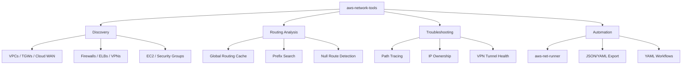
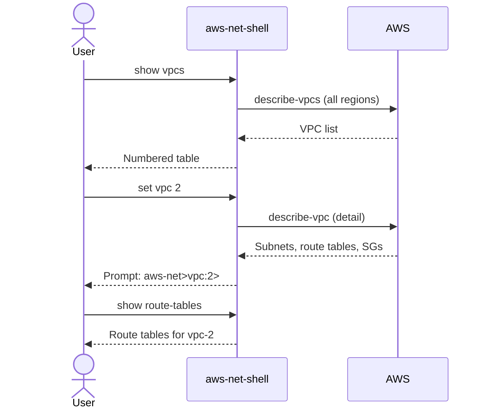
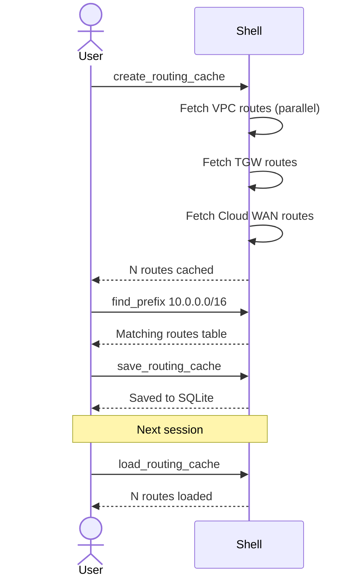
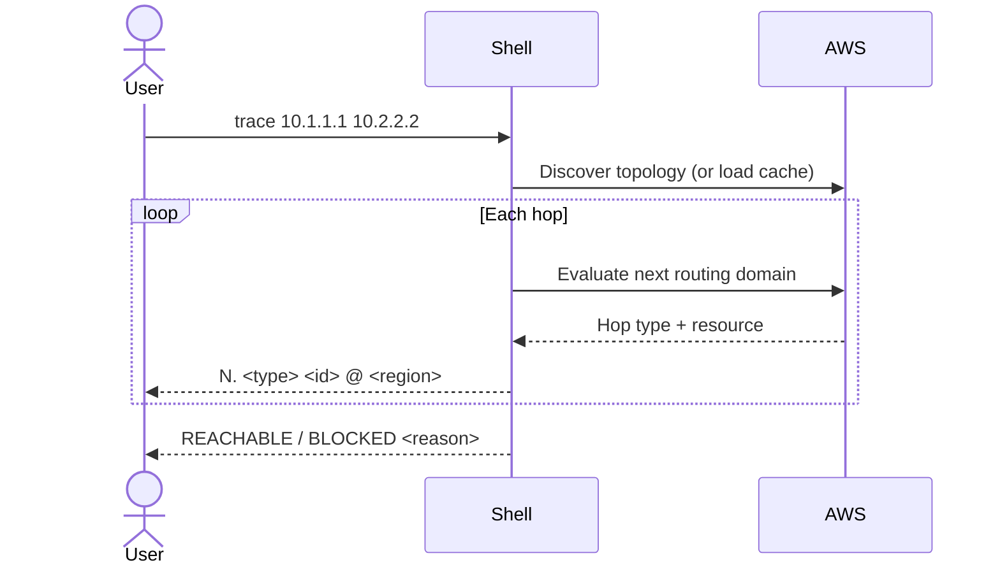
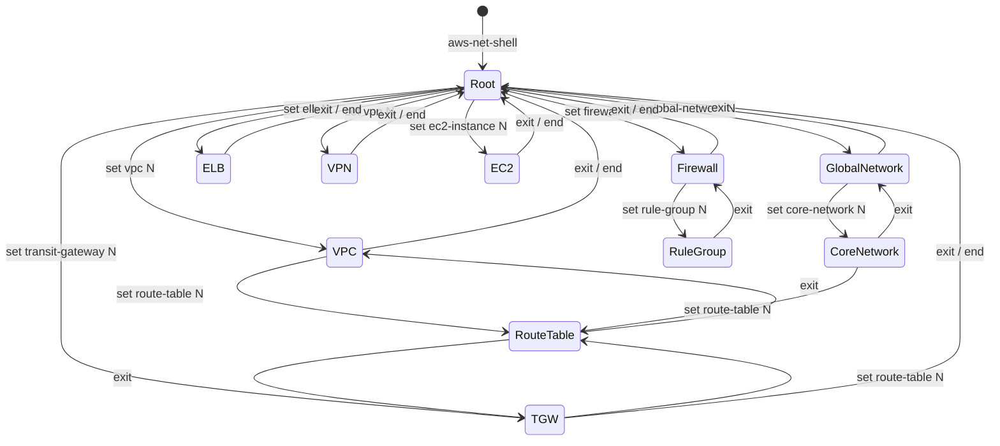
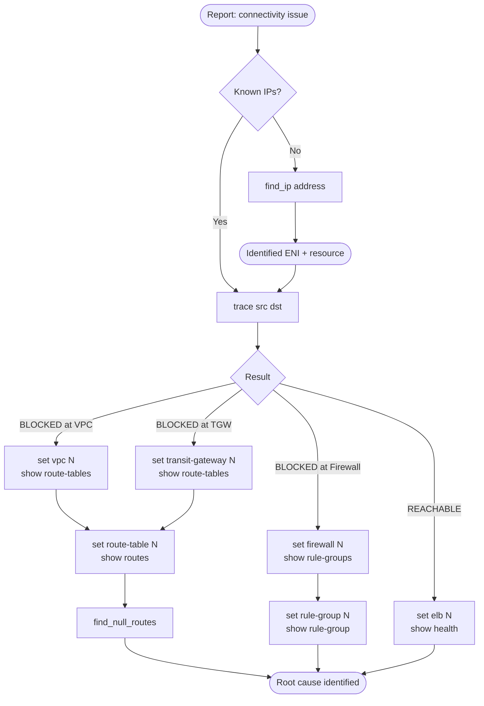

# AWS Network Shell - Use Cases and How-To Guide

## 1. Overview

AWS Network Shell (`aws-network-tools`) provides a Cisco IOS-style hierarchical CLI for
inspecting and troubleshooting AWS networking. Three entry points serve different workflows:

| Entry Point      | Purpose                                    |
|------------------|--------------------------------------------|
| `aws-net-shell`  | Interactive exploration and troubleshooting |
| `aws-net-runner` | Non-interactive automation and scripting    |
| `aws-trace`      | Standalone path-trace between two IPs       |

### Use Case Categories



### Actors

| Actor                | Primary Goals                                          |
|----------------------|--------------------------------------------------------|
| Network Engineer     | Topology discovery, routing inspection, path tracing   |
| DevOps               | Automated inventory, JSON export, CI integration       |
| Security Analyst     | Security group audits, firewall rule inspection        |
| Automation System    | Scripted workflows via `aws-net-runner` and YAML files |

---

## 2. Discovery Use Cases

### Sequence: Root-Level Discovery



### UC-01: Discover VPCs Across Regions

```
aws-net> show vpcs
```

Output: numbered table with Name, ID, CIDRs, Region. Use `set vpc <#>` to enter context.

To limit scope to specific regions first:

```
aws-net> set regions us-east-1,eu-west-1
aws-net> show vpcs
```

### UC-02: Discover Transit Gateways

```
aws-net> show transit-gateways
aws-net> set transit-gateway 1
aws-net(tg:1)> show route-tables
aws-net(tg:1)> show attachments
```

### UC-03: Discover Cloud WAN

Cloud WAN uses a two-level hierarchy: Global Network contains Core Networks.

```
aws-net> show global-networks
aws-net> set global-network 1
aws-net(gl:1)> show core-networks
aws-net(gl:1)> set core-network 1
aws-net(gl:1)(cn:1)> show segments
aws-net(gl:1)(cn:1)> show rib
```

### UC-04: List Network Firewalls

```
aws-net> show firewalls
aws-net> set firewall 2
aws-net(fi:2)> show rule-groups
aws-net(fi:2)> set rule-group 1
aws-net(fi:2)(ru:1)> show rule-group
```

### UC-05: List Load Balancers with Health

```
aws-net> show elbs
aws-net> set elb 3
aws-net(el:3)> show health
aws-net(el:3)> show listeners
aws-net(el:3)> show targets
```

### UC-06: List VPNs with Tunnel Status

```
aws-net> show vpns
aws-net> set vpn 1
aws-net(vp:1)> show tunnels
aws-net(vp:1)> show detail
```

### UC-07: Find EC2 Instances

```
aws-net> show ec2-instances
aws-net> set ec2-instance 4
aws-net(ec:4)> show enis
aws-net(ec:4)> show security-groups
aws-net(ec:4)> show routes
```

You can also select by instance ID directly:

```
aws-net> set ec2-instance i-0abc1234def56789
```

### UC-08: List and Audit Security Groups

```
aws-net> show security-groups
aws-net> show unused-sgs
```

`show security-groups` shows unused groups, risky rules (0.0.0.0/0), and NACL issues.
`show unused-sgs` shows only groups with no active attachments.

---

## 3. Routing Analysis Use Cases

### Sequence: Routing Cache Workflow



### UC-09: Build Routing Cache

The routing cache pre-fetches all routes from VPCs, TGWs, and Cloud WAN for fast
cross-domain queries. Build it once per session; save to SQLite to persist across sessions.

```
aws-net> create_routing_cache
  VPC routes: 1842
  Transit Gateway routes: 340
  Cloud WAN routes: 128
Routing cache created: 2310 routes

aws-net> save_routing_cache
# Next session:
aws-net> load_routing_cache
```

### UC-10: Find a Prefix Across All Routing Domains

Requires routing cache to be populated first.

```
aws-net> find_prefix 10.0.0.0/16
```

Output: table showing Source, Region, Resource, Route Table, Destination, Target, State
across all VPCs, TGWs, and Cloud WAN segments simultaneously.

### UC-11: Find Blackhole / Null Routes

```
aws-net> find_null_routes
```

Reports routes where state is `blackhole`, `null`, or target is empty. Covers all three
routing domains from the cache.

### UC-12: Inspect VPC Route Tables

```
aws-net> show vpcs
aws-net> set vpc 2
aws-net(vi:2)> show route-tables
aws-net(vi:2)> set route-table 1
aws-net(vi:2)(ro:1)> show routes
aws-net(vi:2)(ro:1)> find_prefix 0.0.0.0/0
```

### UC-13: Inspect TGW Route Tables

```
aws-net> show transit-gateways
aws-net> set transit-gateway 1
aws-net(tg:1)> show route-tables
aws-net(tg:1)> set route-table 2
aws-net(tg:1)(ro:2)> show routes
aws-net(tg:1)(ro:2)> find_null_routes
```

### UC-14: Inspect Cloud WAN RIB

```
aws-net> set global-network 1
aws-net(gl:1)> set core-network 1
aws-net(gl:1)(cn:1)> show rib
aws-net(gl:1)(cn:1)> show route-tables
aws-net(gl:1)(cn:1)> show blackhole-routes
```

---

## 4. Troubleshooting Use Cases

### Sequence: Path Trace



### UC-15: Trace Path Between Two IPs

Run from root context. The shell discovers the AWS routing path hop-by-hop.

```
aws-net> trace 10.1.1.100 10.2.5.50

Tracing 10.1.1.100 → 10.2.5.50

1. vpc                vpc-0abc1234  @ us-east-1
2. transit-gateway    tgw-0def5678  @ us-east-1
3. vpc                vpc-0xyz9999  @ us-east-1
4. destination        10.2.5.50     @ us-east-1

REACHABLE
```

Use `--no-cache` to bypass the topology cache:

```
aws-net> trace 10.1.1.100 10.2.5.50 --no-cache
```

The standalone `aws-trace` command works outside the shell:

```
aws-trace 10.1.1.100 10.2.5.50 --profile prod
aws-trace 10.1.1.100 10.2.5.50 --refresh-cache
```

### UC-16: Find IP Owner

Resolves an IP address to its ENI, VPC, subnet, and attached resource.

```
aws-net> find_ip 10.1.32.100
```

Output: table with Region, ENI ID, VPC ID, Subnet ID, Resource Type, Resource ID/Name.

### UC-17: Check VPN Tunnel Status

```
aws-net> show vpns
aws-net> set vpn 2
aws-net(vp:2)> show tunnels
aws-net(vp:2)> show detail
```

Tunnel output shows both IPSec tunnels with their state (UP/DOWN), outside IP, and BGP status.

### UC-18: Inspect Firewall Rules

```
aws-net> show firewalls
aws-net> set firewall 1
aws-net(fi:1)> show rule-groups
aws-net(fi:1)> set rule-group 3
aws-net(fi:1)(ru:3)> show rule-group
```

`show rule-group` displays the stateless and stateful rules for the selected group.
`show policy` (in firewall context) shows the firewall policy document.

### UC-19: Check ELB Target Health

```
aws-net> show elbs
aws-net> set elb 1
aws-net(el:1)> show health
```

Shows each target group with target IDs, ports, and health check state (healthy/unhealthy/draining).

---

## 5. Navigation and Configuration

### Context Navigation State Diagram



| Command       | Effect                                 |
|---------------|----------------------------------------|
| `exit` / `ex` | Pop one context level                  |
| `end`         | Return directly to root                |
| `set X N`     | Enter context X using numbered item N  |

### UC-20: Context Navigation

```
aws-net> show global-networks
aws-net> set global-network 1
aws-net(gl:1)> set core-network 2
aws-net(gl:1)(cn:2)> show rib
aws-net(gl:1)(cn:2)> exit          # back to gl:1
aws-net(gl:1)> end                  # back to root
aws-net>
```

### UC-21: Pipe Filters

Narrow output without leaving the shell. Supports `include`, `exclude`, and `grep` (alias for include).

```
aws-net> show vpcs | include prod
aws-net> show security-groups | exclude 0.0.0.0
aws-net(tg:1)> show route-tables | grep main
```

### UC-22: Watch Mode

Refresh a `show` command on an interval (seconds). Press Ctrl-C to stop.

```
aws-net> show vpns watch 10
aws-net(vp:1)> show tunnels watch 5
```

Alternatively, use `set watch <seconds>` to set a global interval that applies to subsequent `show` commands.

### UC-23: Profile and Region Switching

```
aws-net> set profile prod-account
aws-net> set regions us-east-1,eu-west-1
aws-net> show vpcs

aws-net> set regions all          # remove region filter
aws-net> set profile default
```

Changing profile or regions automatically clears the in-memory cache.

---

## 6. Automation Use Cases

### UC-24: aws-net-runner

`aws-net-runner` drives `aws-net-shell` programmatically via pexpect, printing output to stdout.
Use it from scripts, CI pipelines, or cron jobs.

```bash
# Pass commands as arguments
aws-net-runner "show vpcs" "set vpc 1" "show route-tables"

# With a specific AWS profile
aws-net-runner --profile prod "show transit-gateways"

# Pipe commands from stdin
echo -e "show vpcs\nshow transit-gateways" | aws-net-runner

# Read from a file
aws-net-runner < commands.txt
```

### UC-25: JSON and YAML Export

Switch output format before running a show command, then optionally write to a file.

```
aws-net> set output-format json
aws-net> show vpcs
[{"id": "vpc-0abc", "name": "prod-vpc", "cidrs": ["10.0.0.0/16"], "region": "us-east-1"}, ...]

aws-net> set output-format yaml
aws-net> show transit-gateways

aws-net> set output-format table    # restore default
```

Save the last cached data to a file:

```
aws-net> show vpcs
aws-net> write vpcs.json
```

Or set a persistent output file:

```
aws-net> set output-file /tmp/inventory.json
aws-net> show vpcs                  # automatically saved
```

### UC-26: Save and Load Routing Cache

The routing cache persists to a local SQLite database (`~/.aws-network-tools/cache.db`).

```
aws-net> create_routing_cache       # populate from AWS
aws-net> save_routing_cache         # persist to disk

# In a future session - instant, no AWS calls:
aws-net> load_routing_cache
aws-net> find_prefix 172.16.0.0/12
aws-net> find_null_routes
```

### UC-27: YAML Workflow Files

Workflows are YAML files that define a sequence of shell commands with optional assertions.
Run them with the integration test runner to validate expected behavior.

```yaml
# cloudwan_check.yaml
id: cloudwan_basic
title: "CloudWAN Navigation: Global Network -> Core Network"
tags: [cloudwan, smoke]

workflow:
  - command: "show global-networks"
    assertions:
      - type: "contains"
        value: "Global Networks"
        severity: critical

  - command: "set global-network 1"
    assertions:
      - type: "contains"
        value: "gl:"

  - command: "show core-networks"
    assertions:
      - type: "contains_any"
        values: ["Core Networks", "No core networks"]
```

```bash
# Run with the integration test runner
uv run pytest tests/integration/ -v
```

---

## 7. Quick Reference

### Command Cheat Sheet

| Task                                | Command                                           |
|-------------------------------------|---------------------------------------------------|
| List all VPCs                       | `show vpcs`                                       |
| List Transit Gateways               | `show transit-gateways`                           |
| List firewalls                      | `show firewalls`                                  |
| List load balancers                 | `show elbs`                                       |
| List Site-to-Site VPNs              | `show vpns`                                       |
| List EC2 instances                  | `show ec2-instances`                              |
| Find unused security groups         | `show unused-sgs`                                 |
| List Cloud WAN global networks      | `show global-networks`                            |
| Trace path between two IPs          | `trace <src> <dst>`                               |
| Find which resource owns an IP      | `find_ip <ip>`                                    |
| Find a prefix in all route tables   | `find_prefix 10.0.0.0/8` (requires routing cache) |
| Find blackhole routes               | `find_null_routes` (requires routing cache)       |
| Build routing cache                 | `create_routing_cache`                            |
| Save routing cache to disk          | `save_routing_cache`                              |
| Load routing cache from disk        | `load_routing_cache`                              |
| Switch AWS profile                  | `set profile <name>`                              |
| Limit to specific regions           | `set regions us-east-1,eu-west-1`                 |
| Switch output to JSON               | `set output-format json`                          |
| Export output to file               | `write <filename>`                                |
| Refresh stale cache data            | `refresh` or `refresh all`                        |
| Return to root context              | `end`                                             |
| Go up one context level             | `exit`                                            |
| Show help for current context       | `?` or `show ?`                                   |

### Alias Table

| Alias | Expands To |
|-------|------------|
| `sh`  | `show`     |
| `ex`  | `exit`     |
| `conf`| `config`   |
| `int` | `interface`|
| `no`  | `unset`    |

Examples:

```
aws-net> sh vpcs           # same as: show vpcs
aws-net> ex                # same as: exit
aws-net(tg:1)> sh route-tables  # same as: show route-tables
```

### Context Command Matrix

| Context          | Key Show Commands                                           | Set Commands              |
|------------------|-------------------------------------------------------------|---------------------------|
| Root             | vpcs, transit-gateways, firewalls, elbs, vpns, ec2-instances, global-networks, security-groups | vpc, transit-gateway, firewall, elb, vpn, ec2-instance, global-network, profile, regions |
| vpc              | route-tables, subnets, security-groups, nacls, nat-gateways, endpoints | route-table               |
| transit-gateway  | route-tables, attachments, detail                          | route-table               |
| route-table      | routes                                                      | -                         |
| global-network   | core-networks, detail                                       | core-network              |
| core-network     | rib, route-tables, segments, policy-documents, live-policy, blackhole-routes | route-table               |
| firewall         | rule-groups, policy, detail                                 | rule-group                |
| rule-group       | rule-group                                                  | -                         |
| elb              | health, listeners, targets, detail                          | -                         |
| vpn              | tunnels, detail                                             | -                         |
| ec2-instance     | enis, security-groups, routes, detail                       | -                         |

---

## 8. Application Flow

### Typical Troubleshooting Journey



### Starting a Scoped Investigation

For a targeted investigation, set your scope before running discovery:

```
aws-net> set profile network-prod
aws-net> set regions ap-southeast-2
aws-net> show config                 # verify scope
aws-net> show vpcs
aws-net> show transit-gateways
aws-net> create_routing_cache
aws-net> find_null_routes
```
