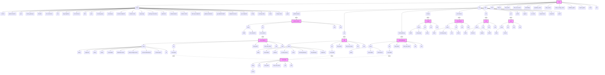

```mermaid
graph TD
    node0[root]
    style node0 fill:#f9f,stroke:#333,stroke-width:2px
    node0 --> node1(show)
    node1 --> node2(version)
    node1 --> node3(global-networks)
    node1 --> node4(vpcs)
    node1 --> node5(transit_gateways)
    node1 --> node6(firewalls)
    node1 --> node7(dx-connections)
    node1 --> node8(enis)
    node1 --> node9(bgp-neighbors)
    node1 --> node10(ec2-instances)
    node1 --> node11(elbs)
    node1 --> node12(vpns)
    node1 --> node13(security-groups)
    node1 --> node14(unused-sgs)
    node1 --> node15(resolver-endpoints)
    node1 --> node16(resolver-rules)
    node1 --> node17(query-logs)
    node1 --> node18(peering-connections)
    node1 --> node19(prefix-lists)
    node1 --> node20(network-alarms)
    node1 --> node21(alarms-critical)
    node1 --> node22(client-vpn-endpoints)
    node1 --> node23(global-accelerators)
    node1 --> node24(ga-endpoint-health)
    node1 --> node25(endpoint-services)
    node1 --> node26(vpc-endpoints)
    node1 --> node27(config)
    node1 --> node28(running-config)
    node1 --> node29(cache)
    node1 --> node30(routing-cache)
    node1 --> node31(graph)
    node0 --> node32(set)
    node32 --> node33(global-network)
    node33 -.->|enters| node34
    node32 --> node35(vpc)
    node35 -.->|enters| node36
    node32 --> node37(transit-gateway)
    node37 -.->|enters| node38
    node32 --> node39(firewall)
    node39 -.->|enters| node40
    node32 --> node41(ec2-instance)
    node41 -.->|enters| node42
    node32 --> node43(elb)
    node43 -.->|enters| node44
    node32 --> node45(vpn)
    node45 -.->|enters| node46
    node32 --> node47(profile)
    node32 --> node48(regions)
    node32 --> node49(no-cache)
    node32 --> node50(output-format)
    node32 --> node51(output-file)
    node32 --> node52(watch)
    node0 --> node53(write)
    node0 --> node54(trace)
    node0 --> node55(find_ip)
    node0 --> node56(find_prefix)
    node0 --> node57(find_null_routes)
    node0 --> node58(reachability)
    node0 --> node59(populate_cache)
    node0 --> node60(clear_cache)
    node0 --> node61(create_routing_cache)
    node0 --> node62(validate_graph)
    node0 --> node63(export_graph)
    node0 --> node64(clear)
    node0 --> node65(exit)
    node34[global-network]
    style node34 fill:#f9f,stroke:#333,stroke-width:2px
    node34 --> node66(show)
    node66 --> node67(detail)
    node66 --> node68(core-networks)
    node34 --> node69(set)
    node69 --> node70(core-network)
    node70 -.->|enters| node71
    node34 --> node72(exit)
    node34 --> node73(end)
    node71[core-network]
    style node71 fill:#f9f,stroke:#333,stroke-width:2px
    node71 --> node74(show)
    node74 --> node75(detail)
    node74 --> node76(segments)
    node74 --> node77(policy)
    node74 --> node78(routes)
    node74 --> node79(route-tables)
    node74 --> node80(blackhole-routes)
    node74 --> node81(policy-change-events)
    node74 --> node82(connect-attachments)
    node74 --> node83(connect-peers)
    node74 --> node84(rib)
    node71 --> node85(set)
    node85 --> node86(route-table)
    node86 -.->|enters| node87
    node71 --> node88(find_prefix)
    node71 --> node89(find_null_routes)
    node71 --> node90(exit)
    node71 --> node91(end)
    node87[route-table]
    style node87 fill:#f9f,stroke:#333,stroke-width:2px
    node87 --> node92(show)
    node92 --> node93(routes)
    node87 --> node94(set)
    node87 --> node95(find_prefix)
    node87 --> node96(find_null_routes)
    node87 --> node97(exit)
    node87 --> node98(end)
    node36[vpc]
    style node36 fill:#f9f,stroke:#333,stroke-width:2px
    node36 --> node99(show)
    node99 --> node100(detail)
    node99 --> node101(route-tables)
    node99 --> node102(subnets)
    node99 --> node103(security-groups)
    node99 --> node104(nacls)
    node99 --> node105(internet-gateways)
    node99 --> node106(nat-gateways)
    node99 --> node107(endpoints)
    node36 --> node108(set)
    node108 --> node109(route-table)
    node109 -.->|enters| node87
    node36 --> node110(find_prefix)
    node36 --> node111(find_null_routes)
    node36 --> node112(exit)
    node36 --> node113(end)
    node38[transit-gateway]
    style node38 fill:#f9f,stroke:#333,stroke-width:2px
    node38 --> node114(show)
    node114 --> node115(detail)
    node114 --> node116(route-tables)
    node114 --> node117(attachments)
    node38 --> node118(set)
    node118 --> node119(route-table)
    node119 -.->|enters| node87
    node38 --> node120(find_prefix)
    node38 --> node121(find_null_routes)
    node38 --> node122(exit)
    node38 --> node123(end)
    node40[firewall]
    style node40 fill:#f9f,stroke:#333,stroke-width:2px
    node40 --> node124(show)
    node124 --> node125(detail)
    node124 --> node126(rule-groups)
    node124 --> node127(policy)
    node40 --> node128(set)
    node40 --> node129(exit)
    node40 --> node130(end)
    node42[ec2-instance]
    style node42 fill:#f9f,stroke:#333,stroke-width:2px
    node42 --> node131(show)
    node131 --> node132(detail)
    node131 --> node133(security-groups)
    node131 --> node134(enis)
    node131 --> node135(routes)
    node42 --> node136(set)
    node42 --> node137(exit)
    node42 --> node138(end)
    node44[elb]
    style node44 fill:#f9f,stroke:#333,stroke-width:2px
    node44 --> node139(show)
    node139 --> node140(detail)
    node139 --> node141(listeners)
    node139 --> node142(targets)
    node139 --> node143(health)
    node44 --> node144(set)
    node44 --> node145(exit)
    node44 --> node146(end)
    node46[vpn]
    style node46 fill:#f9f,stroke:#333,stroke-width:2px
    node46 --> node147(show)
    node147 --> node148(detail)
    node147 --> node149(tunnels)
    node46 --> node150(set)
    node46 --> node151(exit)
    node46 --> node152(end)
```
